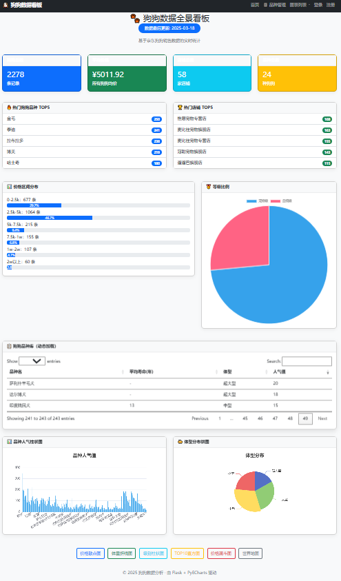

# 🐕 狗狗数据分析系统（AI 搭建）

> 基于 Flask 的数据可视化平台 | **最新版本 v4.2.0** 🎉


**📚 7 天测试学习计划** | **✅ 71+ 测试用例** | **💯 100% 通过率**



---

## 📖 项目简介

狗狗数据分析系统是一个功能完善的数据可视化平台，提供：

- 📊 **数据看板** - 8 项核心指标实时展示
- 📈 **6 种图表** - 散点图、折线图、柱状图、直方图、漏斗图、地图
- 🐶 **网页小宠物** - 可触摸、可喂食、会动的萌宠陪伴（v1.1.0 新增）
- 🔐 **用户认证** - Session + JWT Token 双重支持
- 🎯 **品种管理** - 完整的 CRUD 操作
- ⭐ **收藏功能** - 用户收藏系统
- 📱 **APP Ready** - 标准 RESTful API 接口

---

## ✨ 最新版本亮点（v2.5.1）

### 🎯 新增功能
- ✅ **图表列表页面** - 统一的图表入口，便捷访问所有图表
- ✅ **导航菜单优化** - 简化操作，一键直达图表列表
- ✅ **响应式布局完善** - 全屏幕尺寸完美适配
- ✅ **自定义数据分析** - CSV/Excel 数据上传自动生成图表
- ✅ **首页背景图优化** - 美观背景提升视觉体验

### 🐛 Bug 修复
- ✅ **级别柱状图修复** - 体型分布数据完整展示（小型犬、中型犬、大型犬）
- ✅ **漏斗图标题修复** - 标题位置正常显示
- ✅ **地图功能增强** - 中文地名自动翻译

### 🧪 自动化测试体系（v4.0+ 新增）

#### 测试框架特色
- **自研测试管理工具** - `@test_case` 装饰器 + `TestResult` 类
- **HTML/TXT 报告生成** - 自动生成详细测试报告
- **Bug 追踪集成** - 发现问题自动创建工单
- **执行时间统计** - 精确记录每个用例耗时

#### 测试覆盖范围
| 模块 | 测试文件 | 用例数 | 通过率 |
|------|---------|--------|--------|
| 用户认证 | test_auth.py | 15 | 100% |
| 品种管理 | test_breed.py | 12 | 100% |
| 数据模型 | test_models.py | 8 | 100% |
| 安全性 | test_security.py | 10 | 100% |
| 性能测试 | test_performance.py | 6 | 100% |
| API 接口 | test_api.py | 20 | 100% |
| **总计** | **17 个文件** | **71+** | **100%** |

#### 7 天学习计划
- **Day 1** - pytest 基础入门
- **Day 2** - 测试框架深入
- **Day 3** - 框架扩展与定制
- **Day 4** - 功能测试实战
- **Day 5** - 安全性与性能测试
- **Day 6** - 接口测试完全指南
- **Day 7** - 测试总结与综合实战

详细学习笔记请查看 [docs/](docs/) 目录

### 📊 历史版本
- **v4.2.0** - 完成 7 天测试学习计划，新增 CI/CD 配置
- **v4.1.1** - 修复宠物功能语法错误
- **v4.1.0** - 优化宠物耳朵形状
- **v2.7.1** - 修复宠物重复和睡觉 emoji 问题
- **v2.7.0** - 移除背景图，使用简洁 emoji 显示
- **v2.6.x** - 完善宠物身体结构和 UI 显示
- **v2.5.1** - 网页小宠物功能
- **v2.3.0** - 首页背景图、响应式优化、自定义分析
- **v1.0.0** - 初始版本，安全加固

---

## 🚀 快速开始

### 1. 安装依赖
```bash
pip install -r requirements.txt
```

### 2. 初始化数据库
```bash
python init_db.py
```

### 3. 启动应用
```bash
python app.py
```

## 📁 项目结构

```
fastApiProject/
├── api/                      # API 蓝图模块
│   ├── __init__.py
│   └── routes.py            # RESTful API 定义
├── utils/                    # 工具类
│   ├── __init__.py
│   ├── api_response.py      # API 响应助手
│   └── auth.py              # JWT 认证装饰器
├── templates/                # HTML 模板
├── static/CSS/               # 样式文件
├── docs/                     # 文档目录
│   ├── API 接口文档.md
│   └── 开发文档_重构版.md
├── config.py                 # 配置管理
├── models.py                 # 基础数据模型
├── models_extended.py        # 扩展数据模型
├── charts.py                 # 图表生成
├── map_utils.py              # 地图工具
├── errors.py                 # 错误处理
├── init_db.py                # 数据库初始化
├── app.py                    # 主应用入口
├── requirements.txt          # 依赖包
├── .env                      # 环境变量
├── QUICKSTART.md             # 快速开始指南
└── REFACTOR_SUMMARY.md       # 重构总结
```

---

## 🛠️ 技术栈

### 后端
| 技术 | 版本 | 用途 |
|------|------|------|
| Python | 3.8+ | 开发语言 |
| Flask | 3.1.3 | Web 框架 |
| SQLAlchemy | 2.0.48 | ORM 框架 |
| PyMySQL | 1.1.2 | MySQL 驱动 |
| Flask-Login | 0.6.3 | 用户认证 |
| Flask-Caching | 2.3.1 | 缓存管理 |
| PyJWT | 2.10.1 | JWT Token |
| PyECharts | 2.1.0 | 数据可视化 |
| Pandas | 2.3.3 | 数据处理 |

### 数据库
- MySQL 8.0+
- 字符集：utf8mb4
- 存储引擎：InnoDB

---

## 📺 功能展示

### 首页数据看板


- 8 项核心指标卡片
- 实时数据更新
- 快捷导航入口

### 🎉 网页小宠物（v2.5.1 新增）


**陪伴您的浏览时光！**

#### 特色功能
- 🐶 **可爱互动** - 可触摸、可喂食、会撒娇的萌宠
- 💖 **情感系统** - 开心、困倦、不开心等丰富表情
- 🍖 **喂食玩耍** - 4 种互动动作，增加亲密度
- ⚡ **状态持久** - 自动保存进度，下次访问继续陪伴
- 🎨 **精美动画** - 8 种流畅动画效果，60fps 体验
- 📱 **全平台支持** - 桌面端和移动端完美适配

#### 技术亮点
- ✅ localStorage 本地存储，无需后端
- ✅ CSS 动画优先，性能优秀（<1MB 内存）
- ✅ 智能休眠，节省资源
- ✅ 离线时间计算，真实成长体验

### 图表展示
### 图表展示
- **价格散点图** - 分析价格分布
- **体重折线图** - 趋势变化展示
- **级别柱状图** - 对比分析
- **TOP10 直方图** - 热门排行
- **价格漏斗图** - 转化分析
- **世界地图** - 地域分布

### 品种管理
- 列表展示（分页）
- 添加/编辑/删除
- 搜索筛选
- 数据验证

## 🤝 贡献

欢迎提交 Issue 和 Pull Request！

### 贡献指南
1. Fork 本项目
2. 创建特性分支 (`git checkout -b feature/AmazingFeature`)
3. 提交更改 (`git commit -m 'Add some AmazingFeature'`)
4. 推送到分支 (`git push origin feature/AmazingFeature`)
5. 开启 Pull Request

---

## 📄 许可证

本项目采用 MIT 许可证 - 查看 [LICENSE](LICENSE) 文件了解详情

---

## 👥 团队

- 开发负责人：[Your Name]
- 产品经理：[PM Name]
- 联系方式：[email@example.com]

---

## 🎉 致谢

感谢以下开源项目：
- [Flask](https://flask.palletsprojects.com/)
- [SQLAlchemy](https://www.sqlalchemy.org/)
- [PyECharts](https://pyecharts.org/)
- [Pandas](https://pandas.pydata.org/)

