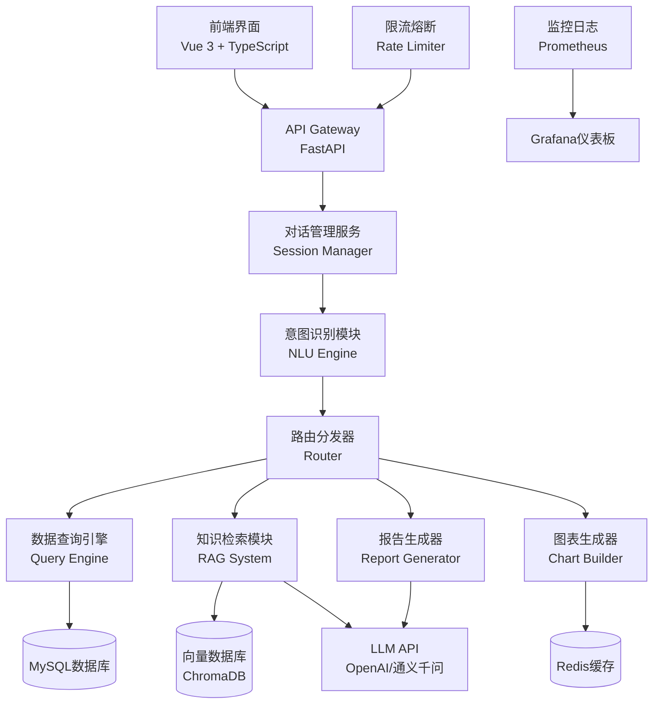

# AI智能助手功能产品需求文档

## 文档信息

| 项目 | 值 |
|------|-----|
| **功能名称** | AI智能宠物顾问 |
| **文档版本** | v1.0.0 |
| **创建日期** | 2026-05-09 |
| **目标读者** | 产品经理、开发团队、测试团队 |
| **优先级** | P0（核心商业化功能） |

---

## 一、功能概述

### 1.1 背景与价值

随着大语言模型技术的成熟，用户对智能化交互的期望日益提升。在宠物数据分析系统中引入AI助手，可以：

- **降低使用门槛**：自然语言交互替代复杂的图表操作
- **提供个性化建议**：基于用户行为和数据的智能推荐
- **增强用户粘性**：7×24小时在线的智能顾问
- **创造商业价值**：高级AI功能可作为付费订阅的核心卖点

### 1.2 产品定位

**AI智能宠物顾问**是一个基于大语言模型的对话式助手，能够：
- 📊 解读数据趋势和洞察
- 💡 提供养宠建议和决策支持
- 🔍 智能检索和分析历史数据
- 📝 自动生成分析报告
- 🎯 个性化品种推荐

### 1.3 目标用户

| 用户类型 | 典型场景 | 核心价值 |
|---------|---------|---------|
| 宠物店经营者 | "帮我分析过去半年金毛的价格趋势" | 快速获得市场洞察，辅助定价决策 |
| 潜在购买者 | "适合新手养的中型犬有哪些？" | 个性化推荐，降低选择困难 |
| 繁育者 | "预测下季度拉布拉多的市场需求" | 数据驱动的繁育计划 |
| 数据分析师 | "生成一份2025年Q4宠物市场报告" | 自动化报告生成，提升效率 |

---

## 二、功能需求

### 2.1 核心功能清单

#### F1: 智能问答（P0）

**功能描述**：用户通过自然语言提问，AI基于系统数据和知识库回答

**支持的问题类型**：

1. **数据查询类**
   ```
   - "金毛犬的平均价格是多少？"
   - "上海地区最受欢迎的3种犬种是什么？"
   - "过去一个月泰迪的价格变化趋势如何？"
   ```

2. **分析洞察类**
   ```
   - "为什么最近柯基的价格上涨了？"
   - "小型犬和大型犬的市场占比对比"
   - "哪些品种的性价比最高？"
   ```

3. **建议推荐类**
   ```
   - "我是上班族，适合养什么狗？"
   - "预算5000元，推荐3个品种"
   - "第一次养狗需要注意什么？"
   ```

4. **报告生成类**
   ```
   - "生成一份金毛犬的市场分析报告"
   - "对比哈士奇和阿拉斯加的优缺点"
   - "导出本月销售数据总结"
   ```

**技术要求**：
- 响应时间：< 3秒（流式输出首字< 1秒）
- 准确率：> 85%（基于人工评估）
- 支持上下文对话（最多10轮）
- 自动识别意图并调用相应数据接口

---

#### F2: 数据可视化联动（P0）

**功能描述**：AI回答中自动嵌入相关图表，支持一键渲染

**交互流程**：
```
用户："展示金毛的价格分布"
    ↓
AI：文字回答 + 散点图预览
    ↓
用户点击图表 → 全屏查看 + 交互操作
```

**支持的图表类型**：
- 散点图（价格分布）
- 折线图（趋势分析）
- 柱状图（对比分析）
- 饼图（占比分析）
- 地图（地域分布）

**技术实现**：
```python
# AI返回结构化数据
{
    "text": "金毛犬的价格主要集中在...",
    "chart_type": "scatter",
    "chart_data": {...},
    "chart_config": {...}
}
```

---

#### F3: 智能报告生成（P1）

**功能描述**：根据用户需求自动生成结构化分析报告

**报告模板**：
1. **市场概览报告**
   - 总体市场规模
   - 热门品种TOP10
   - 价格区间分布
   - 地域分布特点

2. **品种深度分析**
   - 历史价格趋势
   -  popularity变化
   - 竞品对比
   - 未来预测

3. **个性化推荐报告**
   - 基于用户画像的品种推荐
   - 养护成本估算
   - 注意事项提醒

**输出格式**：
- PDF下载
- HTML在线查看
- Markdown源码
- PPT演示文稿（企业版）

---

#### F4: 多轮对话与上下文记忆（P1）

**功能描述**：支持连续对话，记住用户偏好和历史交互

**功能特性**：
```
用户："我想看金毛的数据"
AI：[展示金毛数据]

用户："那泰迪呢？"  ← AI理解"那"指代对比
AI：[展示泰迪数据并对比]

用户："哪个更适合新手？"  ← AI记住前文语境
AI：[基于前两个品种给出建议]
```

**技术要点**：
- 会话ID管理
- 上下文窗口（最多10轮或4000 tokens）
- 用户偏好存储（长期记忆）
- 隐私保护（敏感信息脱敏）

---

#### F5: 语音交互（P2）

**功能描述**：支持语音输入和TTS语音播报

**功能场景**：
- 移动端语音提问
- 无障碍访问支持
- 驾驶模式（安全交互）

**技术方案**：
- 语音识别：Whisper API / 百度语音
- 语音合成：Azure TTS / 阿里云TTS
- 前端集成：Web Speech API

---

#### F6: 智能预警与推送（P2）

**功能描述**：主动推送有价值的市场变化信息

**预警类型**：
```
📈 价格异常波动
   "警告：金毛犬本周价格上涨15%，可能受春节影响"

🔥 新品种热度上升
   "发现：柴犬搜索量增长200%，建议关注"

⚠️ 市场风险提示
   "注意：某品种供应量下降，可能缺货"

💡 个性化推荐
   "根据您的浏览记录，推荐关注边境牧羊犬"
```

**推送渠道**：
- 站内通知
- 邮件订阅
- 微信服务号
- APP推送

---

### 2.2 用户界面设计

#### 2.2.1 聊天入口

**位置**：
- 首页右下角悬浮按钮（始终可见）
- 各图表页面侧边栏（ contextual help）
- 导航栏固定入口

**样式**：
```
┌─────────────────┐
│  🤖 AI助手      │  ← 浮动按钮
└─────────────────┘

点击后展开：
┌──────────────────────────┐
│  AI智能宠物顾问          │  ← 标题栏
├──────────────────────────┤
│                          │
│  [对话历史区域]           │
│  🤖 您好！我可以帮您...  │
│  👤 金毛的价格趋势？      │
│  🤖 根据数据显示...      │
│                          │
├──────────────────────────┤
│ [💡 快捷问题]            │
│ • 热门品种推荐           │
│ • 今日市场行情           │
│ • 生成分析报告           │
├──────────────────────────┤
│ [输入框] [🎤] [📎] [发送]│  ← 底部输入区
└──────────────────────────┘
```

#### 2.2.2 对话气泡设计

**AI回复样式**：
- 文本消息：Markdown渲染（支持表格、代码块）
- 图表消息：可交互的ECharts图表
- 卡片消息：结构化信息展示
- 文件消息：报告下载链接

**用户消息样式**：
- 简洁文本气泡
- 支持图片上传（品种识别）

#### 2.2.3 快捷操作

**预设问题按钮**：
```
💡 您可能想问：
[今日行情] [品种推荐] [价格对比] [养护建议]
```

**快捷命令**：
```
/report    - 生成报告
/chart     - 显示图表
/compare   - 对比分析
/export    - 导出数据
/help      - 帮助文档
```

---

## 三、技术架构设计

### 3.1 整体架构图



### 3.2 核心技术栈

| 层级 | 技术选型 | 说明 |
|------|---------|------|
| **前端** | Vue 3 + TypeScript | 组件化开发，类型安全 |
| | Element Plus | UI组件库 |
| | marked.js | Markdown渲染 |
| | ECharts | 图表渲染 |
| | Web Speech API | 语音交互 |
| **后端** | FastAPI | 高性能异步框架 |
| | LangChain | LLM应用框架 |
| | Pydantic | 数据验证 |
| **AI引擎** | OpenAI GPT-4o | 主LLM（国际） |
| | 阿里通义千问 | 备选LLM（国内） |
| | ChromaDB | 向量数据库 |
| | Sentence Transformers | 文本嵌入模型 |
| **数据存储** | MySQL 8.0 | 业务数据 |
| | Redis 7.0 | 会话缓存、速率限制 |
| | MinIO | 文件存储（报告PDF） |
| **基础设施** | Docker + Kubernetes | 容器化部署 |
| | Nginx | 反向代理、负载均衡 |
| | Celery + RabbitMQ | 异步任务队列 |
| **监控** | Prometheus + Grafana | 性能监控 |
| | Sentry | 错误追踪 |
| | ELK Stack | 日志分析 |

### 3.3 数据库设计

#### 3.3.1 新增表结构

```sql
-- 1. AI对话会话表
CREATE TABLE ai_conversations (
    id INT PRIMARY KEY AUTO_INCREMENT,
    session_id VARCHAR(100) UNIQUE NOT NULL,  -- 会话ID
    user_id INT,                               -- 用户ID（可为空，匿名用户）
    title VARCHAR(200),                        -- 会话标题（自动生成）
    
    -- 会话元数据
    model_used VARCHAR(50),                    -- 使用的LLM模型
    total_tokens INT DEFAULT 0,                -- 总token消耗
    cost_cents INT DEFAULT 0,                  -- 成本（分）
    
    -- 状态
    is_active BOOLEAN DEFAULT TRUE,            -- 是否活跃
    created_at DATETIME DEFAULT CURRENT_TIMESTAMP,
    updated_at DATETIME DEFAULT CURRENT_TIMESTAMP ON UPDATE CURRENT_TIMESTAMP,
    
    INDEX idx_user_session (user_id, session_id),
    INDEX idx_created (created_at),
    FOREIGN KEY (user_id) REFERENCES users(id) ON DELETE CASCADE
);

-- 2. AI对话消息表
CREATE TABLE ai_messages (
    id INT PRIMARY KEY AUTO_INCREMENT,
    conversation_id INT NOT NULL,              -- 关联会话
    
    -- 消息内容
    role ENUM('user', 'assistant', 'system') NOT NULL,
    content TEXT NOT NULL,                     -- 消息文本
    metadata JSON,                             -- 元数据（图表配置、引用来源等）
    
    -- Token信息
    token_count INT DEFAULT 0,                 -- 该消息token数
    model_version VARCHAR(50),                 -- 模型版本
    
    -- 反馈
    user_rating ENUM('like', 'dislike', NULL), -- 用户评分
    feedback_text TEXT,                        -- 反馈文本
    
    created_at DATETIME DEFAULT CURRENT_TIMESTAMP,
    
    INDEX idx_conversation (conversation_id),
    INDEX idx_role (role),
    FOREIGN KEY (conversation_id) REFERENCES ai_conversations(id) ON DELETE CASCADE
);

-- 3. 用户偏好表（用于个性化推荐）
CREATE TABLE user_preferences (
    id INT PRIMARY KEY AUTO_INCREMENT,
    user_id INT NOT NULL UNIQUE,
    
    -- 偏好设置
    preferred_breeds JSON,                     -- 喜欢的品种 ["金毛", "泰迪"]
    budget_range DECIMAL(10,2),                -- 预算范围
    living_space ENUM('apartment', 'house', 'yard'), -- 居住空间
    experience_level ENUM('beginner', 'intermediate', 'expert'), -- 经验水平
    lifestyle JSON,                            -- 生活方式 {"active": true, "work_hours": 8}
    
    -- AI交互偏好
    response_style ENUM('concise', 'detailed', 'balanced') DEFAULT 'balanced',
    language_preference VARCHAR(10) DEFAULT 'zh_CN',
    
    updated_at DATETIME DEFAULT CURRENT_TIMESTAMP ON UPDATE CURRENT_TIMESTAMP,
    
    FOREIGN KEY (user_id) REFERENCES users(id) ON DELETE CASCADE
);

-- 4. 知识库文档表（RAG系统）
CREATE TABLE knowledge_documents (
    id INT PRIMARY KEY AUTO_INCREMENT,
    
    -- 文档信息
    title VARCHAR(200) NOT NULL,               -- 文档标题
    content TEXT NOT NULL,                     -- 文档内容
    doc_type ENUM('breed_info', 'care_guide', 'market_report', 'faq'),
    source_url VARCHAR(500),                   -- 来源URL
    
    -- 向量嵌入
    embedding_id VARCHAR(100),                 -- ChromaDB中的向量ID
    embedding_model VARCHAR(50),               -- 嵌入模型版本
    
    -- 元数据
    tags JSON,                                 -- 标签 ["金毛", "养护", "饮食"]
    relevance_score FLOAT DEFAULT 1.0,         -- 相关性权重
    
    -- 状态
    is_active BOOLEAN DEFAULT TRUE,
    created_at DATETIME DEFAULT CURRENT_TIMESTAMP,
    updated_at DATETIME DEFAULT CURRENT_TIMESTAMP ON UPDATE CURRENT_TIMESTAMP,
    
    INDEX idx_type (doc_type),
    INDEX idx_tags ((CAST(tags AS CHAR(255)) ARRAY))  -- MySQL 8.0+ JSON索引
);

-- 5. AI功能使用统计表
CREATE TABLE ai_usage_stats (
    id INT PRIMARY KEY AUTO_INCREMENT,
    user_id INT,
    
    -- 使用统计
    query_count INT DEFAULT 0,                 -- 查询次数
    total_tokens INT DEFAULT 0,                -- 总token消耗
    total_cost_cents INT DEFAULT 0,            -- 总成本
    
    -- 分类统计
    query_types JSON,                          -- {"data_query": 10, "recommendation": 5}
    satisfaction_rate FLOAT,                   -- 满意度（基于点赞率）
    
    -- 时间维度
    stat_date DATE NOT NULL,
    
    UNIQUE KEY unique_user_date (user_id, stat_date),
    INDEX idx_date (stat_date),
    FOREIGN KEY (user_id) REFERENCES users(id) ON DELETE SET NULL
);
```

---

### 3.4 核心模块实现

#### 3.4.1 意图识别模块

```python
"""
意图识别引擎
负责解析用户问题，识别意图类型和提取关键参数
"""
from enum import Enum
from pydantic import BaseModel
from typing import Optional, List, Dict
import openai
from langchain.prompts import PromptTemplate

class IntentType(Enum):
    DATA_QUERY = "data_query"           # 数据查询
    TREND_ANALYSIS = "trend_analysis"   # 趋势分析
    RECOMMENDATION = "recommendation"   # 品种推荐
    COMPARISON = "comparison"           # 对比分析
    REPORT_GENERATION = "report"        # 报告生成
    GENERAL_QA = "general_qa"          # 通用问答
    CHART_REQUEST = "chart_request"     # 图表请求

class ExtractedParams(BaseModel):
    """提取的参数"""
    breed_names: List[str] = []         # 品种名称
    price_range: Optional[tuple] = None # 价格范围
    location: Optional[str] = None      # 地区
    time_range: Optional[str] = None    # 时间范围
    chart_type: Optional[str] = None    # 图表类型
    report_type: Optional[str] = None   # 报告类型

class IntentResult(BaseModel):
    """意图识别结果"""
    intent_type: IntentType
    confidence: float                    # 置信度 0-1
    params: ExtractedParams
    original_query: str

class IntentEngine:
    """意图识别引擎"""
    
    def __init__(self, llm_client):
        self.llm = llm_client
        
        # 意图识别提示词模板
        self.prompt_template = PromptTemplate.from_template("""
        你是一个宠物数据分析系统的意图识别助手。请分析用户问题，识别意图类型并提取关键参数。
        
        支持的意图类型：
        - data_query: 查询具体数据（如"金毛的平均价格"）
        - trend_analysis: 趋势分析（如"金毛价格走势"）
        - recommendation: 品种推荐（如"适合新手的犬种"）
        - comparison: 对比分析（如"金毛和泰迪对比"）
        - report: 报告生成（如"生成市场报告"）
        - chart_request: 图表请求（如"展示价格分布图"）
        - general_qa: 通用问答（如"怎么养狗"）
        
        用户问题：{query}
        
        请以JSON格式返回：
        {{
            "intent_type": "意图类型",
            "confidence": 0.95,
            "params": {{
                "breed_names": ["金毛"],
                "price_range": [1000, 5000],
                "location": "上海",
                "time_range": "最近一个月",
                "chart_type": "scatter",
                "report_type": "market_overview"
            }}
        }}
        """)
    
    def recognize_intent(self, query: str, context: List[Dict] = None) -> IntentResult:
        """
        识别用户意图
        
        Args:
            query: 用户问题
            context: 对话上下文（可选）
        
        Returns:
            IntentResult: 意图识别结果
        """
        # 构建完整提示词
        context_str = "\n".join([f"{msg['role']}: {msg['content']}" 
                                 for msg in context[-3:]]) if context else ""
        
        full_prompt = self.prompt_template.format(query=query)
        if context_str:
            full_prompt += f"\n\n对话历史：\n{context_str}"
        
        # 调用LLM进行意图识别
        response = self.llm.chat.completions.create(
            model="gpt-4o-mini",  # 使用轻量级模型降低成本
            messages=[
                {"role": "system", "content": "你是意图识别专家，只返回JSON"},
                {"role": "user", "content": full_prompt}
            ],
            temperature=0.1,  # 低温度保证稳定性
            response_format={"type": "json_object"}
        )
        
        # 解析结果
        result_json = response.choices[0].message.content
        result_dict = json.loads(result_json)
        
        return IntentResult(
            intent_type=IntentType(result_dict["intent_type"]),
            confidence=result_dict["confidence"],
            params=ExtractedParams(**result_dict.get("params", {})),
            original_query=query
        )
```

#### 3.4.2 RAG知识检索系统

```python
"""
RAG（检索增强生成）系统
结合向量检索和LLM生成准确回答
"""
import chromadb
from chromadb.config import Settings
from sentence_transformers import SentenceTransformer
from typing import List, Dict
import numpy as np

class RAGSystem:
    """RAG知识检索系统"""
    
    def __init__(self, db_path="./chroma_db"):
        # 初始化向量数据库
        self.chroma_client = chromadb.PersistentClient(path=db_path)
        self.collection = self.chroma_client.get_or_create_collection(
            name="pet_knowledge",
            metadata={"description": "宠物行业知识库"}
        )
        
        # 加载嵌入模型（中文优化）
        self.embedding_model = SentenceTransformer(
            'paraphrase-multilingual-MiniLM-L12-v2'
        )
        
        # 相似度阈值
        self.similarity_threshold = 0.7
    
    def add_document(self, doc_id: str, content: str, metadata: Dict):
        """
        添加文档到知识库
        
        Args:
            doc_id: 文档ID
            content: 文档内容
            metadata: 元数据（标题、类型、标签等）
        """
        # 生成分段（避免超长文本）
        chunks = self._split_text(content, chunk_size=500, overlap=50)
        
        for i, chunk in enumerate(chunks):
            chunk_id = f"{doc_id}_chunk_{i}"
            
            # 生成向量嵌入
            embedding = self.embedding_model.encode(chunk).tolist()
            
            # 存储到ChromaDB
            self.collection.add(
                ids=[chunk_id],
                embeddings=[embedding],
                documents=[chunk],
                metadatas=[{**metadata, "chunk_index": i}]
            )
    
    def search_knowledge(self, query: str, top_k: int = 5) -> List[Dict]:
        """
        检索相关知识
        
        Args:
            query: 查询文本
            top_k: 返回最相关的K个文档
        
        Returns:
            相关文档列表
        """
        # 生成查询向量
        query_embedding = self.embedding_model.encode(query).tolist()
        
        # 向量相似度搜索
        results = self.collection.query(
            query_embeddings=[query_embedding],
            n_results=top_k * 2,  # 多取一些，后续过滤
            include=["documents", "metadatas", "distances"]
        )
        
        # 过滤低相似度结果
        relevant_docs = []
        for doc, meta, distance in zip(
            results['documents'][0],
            results['metadatas'][0],
            results['distances'][0]
        ):
            # ChromaDB返回的是距离，转换为相似度
            similarity = 1 / (1 + distance)
            
            if similarity >= self.similarity_threshold:
                relevant_docs.append({
                    "content": doc,
                    "metadata": meta,
                    "similarity": similarity
                })
        
        # 按相似度排序
        relevant_docs.sort(key=lambda x: x["similarity"], reverse=True)
        
        return relevant_docs[:top_k]
    
    def generate_answer(self, query: str, llm_client, context_docs: List[Dict]) -> str:
        """
        基于检索到的知识生成回答
        
        Args:
            query: 用户问题
            llm_client: LLM客户端
            context_docs: 相关文档列表
        
        Returns:
            生成的回答
        """
        # 构建上下文
        context_text = "\n\n".join([
            f"【来源：{doc['metadata'].get('title', '未知')}】\n{doc['content']}"
            for doc in context_docs
        ])
        
        # 构建提示词
        prompt = f"""
        你是一个专业的宠物数据顾问。请基于以下参考资料回答用户问题。
        
        参考资料：
        {context_text}
        
        用户问题：{query}
        
        要求：
        1. 优先使用参考资料中的信息
        2. 如果资料不足，可以补充通用知识，但要标注
        3. 回答要专业、准确、易懂
        4. 适当使用数据支撑观点
        5. 如有不确定性，要诚实说明
        
        请开始回答：
        """
        
        # 调用LLM生成回答
        response = llm_client.chat.completions.create(
            model="gpt-4o",
            messages=[
                {"role": "system", "content": "你是宠物数据专家顾问"},
                {"role": "user", "content": prompt}
            ],
            temperature=0.7,
            max_tokens=1000
        )
        
        return response.choices[0].message.content
    
    def _split_text(self, text: str, chunk_size: int = 500, overlap: int = 50) -> List[str]:
        """文本分段"""
        # 简单实现：按句子分割
        sentences = text.split('。')
        chunks = []
        current_chunk = []
        current_length = 0
        
        for sentence in sentences:
            sentence_len = len(sentence)
            
            if current_length + sentence_len > chunk_size and current_chunk:
                chunks.append('。'.join(current_chunk) + '。')
                # 保留重叠部分
                overlap_sentences = current_chunk[-(overlap // 20):]
                current_chunk = overlap_sentences + [sentence]
                current_length = sum(len(s) for s in current_chunk)
            else:
                current_chunk.append(sentence)
                current_length += sentence_len
        
        if current_chunk:
            chunks.append('。'.join(current_chunk) + '。')
        
        return chunks
```

#### 3.4.3 数据查询引擎

```python
"""
数据查询引擎
将自然语言问题转换为SQL查询，执行并格式化结果
"""
from sqlalchemy import text
from models import db
import pandas as pd

class QueryEngine:
    """数据查询引擎"""
    
    def __init__(self):
        self.db = db
    
    def execute_query(self, intent_params) -> Dict:
        """
        执行数据查询
        
        Args:
            intent_params: 意图识别提取的参数
        
        Returns:
            查询结果字典
        """
        intent_type = intent_params.intent_type
        
        if intent_type == IntentType.DATA_QUERY:
            return self._handle_data_query(intent_params.params)
        elif intent_type == IntentType.TREND_ANALYSIS:
            return self._handle_trend_analysis(intent_params.params)
        elif intent_type == IntentType.COMPARISON:
            return self._handle_comparison(intent_params.params)
        else:
            raise ValueError(f"Unsupported intent type: {intent_type}")
    
    def _handle_data_query(self, params: ExtractedParams) -> Dict:
        """处理数据查询"""
        breed_name = params.breed_names[0] if params.breed_names else None
        
        if not breed_name:
            return {"error": "请指定品种名称"}
        
        # 构建SQL查询
        sql = text("""
            SELECT 
                AVG(price) as avg_price,
                MIN(price) as min_price,
                MAX(price) as max_price,
                COUNT(*) as total_count
            FROM jd_dogs d
            JOIN dog_breeds b ON d.breed_name = b.breed_name
            WHERE b.breed_name LIKE :breed_name
        """)
        
        result = db.session.execute(sql, {"breed_name": f"%{breed_name}%"})
        row = result.fetchone()
        
        if not row or row.total_count == 0:
            return {"error": f"未找到'{breed_name}'的相关数据"}
        
        return {
            "success": True,
            "data": {
                "breed": breed_name,
                "avg_price": float(row.avg_price),
                "min_price": float(row.min_price),
                "max_price": float(row.max_price),
                "total_count": row.total_count
            },
            "summary": f"{breed_name}的平均价格为{row.avg_price:.0f}元，共有{row.total_count}条记录"
        }
    
    def _handle_trend_analysis(self, params: ExtractedParams) -> Dict:
        """处理趋势分析"""
        # 实现价格趋势查询逻辑
        pass
    
    def _handle_comparison(self, params: ExtractedParams) -> Dict:
        """处理对比分析"""
        breeds = params.breed_names
        if len(breeds) < 2:
            return {"error": "请至少指定两个品种进行对比"}
        
        # 实现对比查询逻辑
        pass
```

#### 3.4.4 对话管理服务

```python
"""
对话管理服务
管理会话状态、上下文历史和消息持久化
"""
from datetime import datetime, timedelta
from typing import List, Dict, Optional
import redis
import json

class ConversationManager:
    """对话管理器"""
    
    def __init__(self, redis_client: redis.Redis, db_session):
        self.redis = redis_client
        self.db = db_session
        self.context_window = 10  # 上下文窗口大小
        self.session_ttl = 3600   # 会话过期时间（1小时）
    
    def create_session(self, user_id: Optional[int] = None) -> str:
        """
        创建新会话
        
        Returns:
            session_id: 会话ID
        """
        import uuid
        session_id = str(uuid.uuid4())
        
        # 在Redis中初始化会话
        session_data = {
            "user_id": user_id,
            "created_at": datetime.now().isoformat(),
            "message_count": 0,
            "is_active": True
        }
        
        self.redis.setex(
            f"session:{session_id}",
            self.session_ttl,
            json.dumps(session_data)
        )
        
        # 在数据库中创建记录
        from models_extended import AIConversation
        conversation = AIConversation(
            session_id=session_id,
            user_id=user_id,
            title="新对话"
        )
        self.db.add(conversation)
        self.db.commit()
        
        return session_id
    
    def add_message(self, session_id: str, role: str, content: str, 
                   metadata: Dict = None) -> int:
        """
        添加消息到会话
        
        Args:
            session_id: 会话ID
            role: 角色（user/assistant/system）
            content: 消息内容
            metadata: 元数据
        
        Returns:
            message_id: 消息ID
        """
        # 更新Redis中的会话
        session_key = f"session:{session_id}"
        session_data = json.loads(self.redis.get(session_key))
        session_data["message_count"] += 1
        self.redis.setex(session_key, self.session_ttl, json.dumps(session_data))
        
        # 添加到上下文历史
        context_key = f"context:{session_id}"
        message = {
            "role": role,
            "content": content,
            "timestamp": datetime.now().isoformat(),
            "metadata": metadata or {}
        }
        
        # 使用Redis List存储上下文
        self.redis.lpush(context_key, json.dumps(message))
        self.redis.ltrim(context_key, 0, self.context_window - 1)
        self.redis.expire(context_key, self.session_ttl)
        
        # 持久化到数据库
        from models_extended import AIMessage
        ai_message = AIMessage(
            conversation_id=self._get_conversation_id(session_id),
            role=role,
            content=content,
            metadata=json.dumps(metadata) if metadata else None
        )
        self.db.add(ai_message)
        self.db.commit()
        
        return ai_message.id
    
    def get_context(self, session_id: str) -> List[Dict]:
        """
        获取会话上下文
        
        Returns:
            消息列表（按时间顺序）
        """
        context_key = f"context:{session_id}"
        messages = self.redis.lrange(context_key, 0, -1)
        
        # Redis返回的是逆序，需要反转
        context = [json.loads(msg) for msg in reversed(messages)]
        
        return context
    
    def clear_session(self, session_id: str):
        """清除会话"""
        self.redis.delete(f"session:{session_id}")
        self.redis.delete(f"context:{session_id}")
        
        # 标记数据库中的会话为非活跃
        conversation_id = self._get_conversation_id(session_id)
        from models_extended import AIConversation
        conv = self.db.query(AIConversation).get(conversation_id)
        if conv:
            conv.is_active = False
            self.db.commit()
    
    def _get_conversation_id(self, session_id: str) -> int:
        """从session_id获取数据库中的conversation_id"""
        from models_extended import AIConversation
        conv = self.db.query(AIConversation).filter_by(session_id=session_id).first()
        return conv.id if conv else None
```

---

### 3.5 API接口设计

#### 3.5.1 RESTful API

```python
"""
AI助手API接口
"""
from fastapi import FastAPI, HTTPException, Depends, Header
from pydantic import BaseModel
from typing import Optional, List

app = FastAPI(title="AI智能助手API", version="1.0.0")

# ===== 数据模型 =====

class ChatRequest(BaseModel):
    """聊天请求"""
    session_id: Optional[str] = None  # 会话ID（首次为空）
    message: str                       # 用户消息
    stream: bool = False               # 是否流式输出

class ChatResponse(BaseModel):
    """聊天响应"""
    session_id: str                    # 会话ID
    message_id: int                    # 消息ID
    role: str = "assistant"            # 角色
    content: str                       # 回复内容
    chart_data: Optional[Dict] = None  # 图表数据（如有）
    sources: Optional[List[str]] = None  # 引用来源
    token_usage: Optional[Dict] = None   # Token使用情况

class FeedbackRequest(BaseModel):
    """反馈请求"""
    message_id: int
    rating: str  # "like" or "dislike"
    comment: Optional[str] = None

# ===== API端点 =====

@app.post("/api/v1/ai/chat", response_model=ChatResponse)
async def chat(request: ChatRequest, authorization: str = Header(...)):
    """
    发送消息并获取AI回复
    
    - 支持普通模式和流式模式
    - 自动管理会话上下文
    - 返回结构化响应（含图表数据）
    """
    # 验证用户身份
    user_id = verify_token(authorization)
    
    # 创建或获取会话
    session_id = request.session_id or conversation_manager.create_session(user_id)
    
    try:
        # 1. 保存用户消息
        conversation_manager.add_message(
            session_id, "user", request.message
        )
        
        # 2. 获取上下文
        context = conversation_manager.get_context(session_id)
        
        # 3. 意图识别
        intent_result = intent_engine.recognize_intent(
            request.message, context
        )
        
        # 4. 根据意图路由到不同处理器
        if intent_result.intent_type == IntentType.DATA_QUERY:
            response_content = await handle_data_query(
                intent_result, context
            )
        elif intent_result.intent_type == IntentType.RECOMMENDATION:
            response_content = await handle_recommendation(
                intent_result, context
            )
        elif intent_result.intent_type == IntentType.GENERAL_QA:
            response_content = await handle_general_qa(
                request.message, context
            )
        else:
            response_content = await handle_default(request.message, context)
        
        # 5. 保存AI回复
        message_id = conversation_manager.add_message(
            session_id, "assistant", response_content["text"],
            metadata={
                "chart_data": response_content.get("chart_data"),
                "sources": response_content.get("sources"),
                "intent_type": intent_result.intent_type.value
            }
        )
        
        # 6. 返回响应
        return ChatResponse(
            session_id=session_id,
            message_id=message_id,
            content=response_content["text"],
            chart_data=response_content.get("chart_data"),
            sources=response_content.get("sources"),
            token_usage=response_content.get("token_usage")
        )
    
    except Exception as e:
        raise HTTPException(status_code=500, detail=str(e))


@app.post("/api/v1/ai/chat/stream")
async def chat_stream(request: ChatRequest, authorization: str = Header(...)):
    """
    流式聊天接口（SSE）
    
    返回Server-Sent Events格式：
    data: {"delta": "您"}
    data: {"delta": "好"}
    data: {"done": true}
    """
    from fastapi.responses import StreamingResponse
    
    async def event_generator():
        # 类似chat逻辑，但逐token返回
        pass
    
    return StreamingResponse(
        event_generator(),
        media_type="text/event-stream"
    )


@app.post("/api/v1/ai/feedback")
async def submit_feedback(request: FeedbackRequest):
    """提交用户反馈"""
    # 更新数据库中的用户评分
    pass


@app.get("/api/v1/ai/sessions")
async def list_sessions(authorization: str = Header(...)):
    """获取用户的会话列表"""
    user_id = verify_token(authorization)
    # 返回会话列表（标题、最后消息时间、消息数）
    pass


@app.delete("/api/v1/ai/sessions/{session_id}")
async def delete_session(session_id: str, authorization: str = Header(...)):
    """删除会话"""
    conversation_manager.clear_session(session_id)
    return {"success": True}


@app.post("/api/v1/ai/report/generate")
async def generate_report(report_type: str, params: Dict):
    """生成分析报告"""
    # 调用报告生成器
    pass


@app.get("/api/v1/ai/reports/{report_id}")
async def download_report(report_id: int):
    """下载报告（PDF/HTML）"""
    pass
```

---

### 3.6 前端组件实现

#### 3.6.1 Vue 3聊天组件

```vue
<!-- components/AIChat.vue -->
<template>
  <div class="ai-chat-container">
    <!-- 聊天头部 -->
    <div class="chat-header">
      <h3>🤖 AI智能宠物顾问</h3>
      <button @click="toggleChat" class="close-btn">×</button>
    </div>
    
    <!-- 消息列表 -->
    <div class="chat-messages" ref="messagesContainer">
      <div 
        v-for="msg in messages" 
        :key="msg.id"
        :class="['message', msg.role]"
      >
        <div class="avatar">
          {{ msg.role === 'user' ? '👤' : '🤖' }}
        </div>
        <div class="message-content">
          <!-- 文本消息 -->
          <div v-if="msg.type === 'text'" class="text-message">
            <markdown-renderer :content="msg.content" />
          </div>
          
          <!-- 图表消息 -->
          <div v-if="msg.chart_data" class="chart-message">
            <echarts-chart 
              :option="msg.chart_data" 
              style="height: 300px;"
            />
          </div>
          
          <!-- 来源引用 -->
          <div v-if="msg.sources?.length" class="sources">
            <small>参考来源：</small>
            <ul>
              <li v-for="(source, idx) in msg.sources" :key="idx">
                {{ source }}
              </li>
            </ul>
          </div>
          
          <!-- 反馈按钮 -->
          <div class="message-actions" v-if="msg.role === 'assistant'">
            <button @click="giveFeedback(msg.id, 'like')" title="有用">
              👍
            </button>
            <button @click="giveFeedback(msg.id, 'dislike')" title="无用">
              👎
            </button>
          </div>
        </div>
      </div>
      
      <!-- Loading指示器 -->
      <div v-if="isLoading" class="message assistant">
        <div class="typing-indicator">
          <span></span><span></span><span></span>
        </div>
      </div>
    </div>
    
    <!-- 快捷问题 -->
    <div class="quick-questions" v-if="messages.length === 0">
      <h4>💡 您可以这样问我：</h4>
      <button 
        v-for="q in quickQuestions" 
        :key="q"
        @click="sendQuickQuestion(q)"
        class="quick-btn"
      >
        {{ q }}
      </button>
    </div>
    
    <!-- 输入区域 -->
    <div class="chat-input">
      <input
        v-model="inputMessage"
        @keyup.enter="sendMessage"
        placeholder="输入您的问题..."
        :disabled="isLoading"
      />
      <button 
        @click="sendMessage" 
        :disabled="!inputMessage.trim() || isLoading"
        class="send-btn"
      >
        发送
      </button>
    </div>
  </div>
</template>

<script setup lang="ts">
import { ref, nextTick, onMounted } from 'vue'
import MarkdownRenderer from './MarkdownRenderer.vue'
import EchartsChart from './EchartsChart.vue'
import { useAIChat } from '@/composables/useAIChat'

const {
  sessionId,
  messages,
  isLoading,
  sendMessage,
  giveFeedback,
  initSession
} = useAIChat()

const inputMessage = ref('')
const messagesContainer = ref<HTMLElement>()

// 快捷问题
const quickQuestions = [
  '今日市场行情如何？',
  '推荐适合新手的犬种',
  '金毛和泰迪哪个更好养？',
  '生成月度分析报告'
]

// 发送快捷问题
const sendQuickQuestion = (question: string) => {
  inputMessage.value = question
  sendMessage()
}

// 自动滚动到底部
const scrollToBottom = async () => {
  await nextTick()
  if (messagesContainer.value) {
    messagesContainer.value.scrollTop = messagesContainer.value.scrollHeight
  }
}

// 监听消息变化
watch(messages, () => {
  scrollToBottom()
}, { deep: true })

onMounted(() => {
  initSession()
})
</script>

<style scoped>
.ai-chat-container {
  display: flex;
  flex-direction: column;
  height: 600px;
  background: white;
  border-radius: 12px;
  box-shadow: 0 4px 20px rgba(0,0,0,0.1);
}

.chat-header {
  padding: 16px;
  border-bottom: 1px solid #eee;
  display: flex;
  justify-content: space-between;
  align-items: center;
}

.chat-messages {
  flex: 1;
  overflow-y: auto;
  padding: 16px;
}

.message {
  display: flex;
  margin-bottom: 16px;
  gap: 12px;
}

.message.user {
  flex-direction: row-reverse;
}

.avatar {
  width: 36px;
  height: 36px;
  border-radius: 50%;
  background: #f0f0f0;
  display: flex;
  align-items: center;
  justify-content: center;
  font-size: 18px;
}

.message-content {
  max-width: 70%;
  padding: 12px 16px;
  border-radius: 12px;
  background: #f5f5f5;
}

.message.user .message-content {
  background: #667eea;
  color: white;
}

.typing-indicator span {
  display: inline-block;
  width: 8px;
  height: 8px;
  border-radius: 50%;
  background: #999;
  margin: 0 2px;
  animation: typing 1.4s infinite;
}

.typing-indicator span:nth-child(2) { animation-delay: 0.2s; }
.typing-indicator span:nth-child(3) { animation-delay: 0.4s; }

@keyframes typing {
  0%, 60%, 100% { transform: translateY(0); }
  30% { transform: translateY(-10px); }
}

.quick-questions {
  padding: 16px;
  border-top: 1px solid #eee;
}

.quick-btn {
  display: block;
  width: 100%;
  margin: 8px 0;
  padding: 10px;
  border: 1px solid #ddd;
  border-radius: 8px;
  background: white;
  cursor: pointer;
  transition: all 0.2s;
}

.quick-btn:hover {
  background: #f5f5f5;
  border-color: #667eea;
}

.chat-input {
  display: flex;
  padding: 16px;
  border-top: 1px solid #eee;
  gap: 8px;
}

.chat-input input {
  flex: 1;
  padding: 10px 16px;
  border: 1px solid #ddd;
  border-radius: 8px;
  outline: none;
}

.send-btn {
  padding: 10px 20px;
  background: #667eea;
  color: white;
  border: none;
  border-radius: 8px;
  cursor: pointer;
}

.send-btn:disabled {
  opacity: 0.5;
  cursor: not-allowed;
}
</style>
```

---

## 四、实施计划

### 4.1 开发阶段划分

#### 阶段一：基础架构搭建（2周）

**目标**：完成核心基础设施和基础对话功能

**任务清单**：
- [ ] 搭建FastAPI后端框架
- [ ] 集成LangChain和LLM API
- [ ] 部署ChromaDB向量数据库
- [ ] 实现基础的意图识别
- [ ] 开发简单的问答功能
- [ ] 前端聊天UI组件
- [ ] 会话管理（Redis）
- [ ] 基础监控和日志

**交付物**：
- 可用的AI对话原型
- API文档v0.1
- 技术架构文档

---

#### 阶段二：核心功能开发（3周）

**目标**：实现数据查询、图表联动、RAG系统

**任务清单**：
- [ ] 完善意图识别（支持所有类型）
- [ ] 实现数据查询引擎
- [ ] 开发RAG知识检索系统
- [ ] 构建知识库（导入文档、生成向量）
- [ ] 图表联动功能
- [ ] 上下文管理优化
- [ ] 流式输出支持
- [ ] 用户反馈系统

**交付物**：
- 完整的AI助手功能
- 知识库v1.0（100+文档）
- 性能测试报告

---

#### 阶段三：高级功能开发（2周）

**目标**：报告生成、语音交互、个性化推荐

**任务清单**：
- [ ] 智能报告生成器
- [ ] PDF/HTML报告导出
- [ ] 语音输入/输出集成
- [ ] 用户偏好学习
- [ ] 个性化推荐算法
- [ ] 智能预警系统
- [ ] 多语言支持

**交付物**：
- 高级功能模块
- 用户画像系统
- A/B测试框架

---

#### 阶段四：优化与测试（1周）

**目标**：性能优化、安全加固、全面测试

**任务清单**：
- [ ] 响应时间优化（<3秒）
- [ ] 并发压力测试
- [ ] 安全性审计（注入攻击、数据泄露）
- [ ] 单元测试覆盖率>80%
- [ ] E2E测试
- [ ] 用户体验测试
- [ ] Bug修复

**交付物**：
- 性能优化报告
- 安全审计报告
- 测试报告

---

#### 阶段五：上线准备（1周）

**目标**：生产环境部署、监控告警、文档完善

**任务清单**：
- [ ] Kubernetes集群部署
- [ ] CI/CD流水线
- [ ] 监控告警配置（Prometheus + Grafana）
- [ ] 错误追踪（Sentry）
- [ ] 用户文档编写
- [ ] API文档完善
- [ ] 运维手册
- [ ] 灰度发布方案

**交付物**：
- 生产环境就绪
- 完整文档体系
- 上线检查清单

---

### 4.2 人员配置

| 角色 | 人数 | 职责 |
|------|------|------|
| 后端开发 | 2人 | FastAPI开发、LLM集成、数据库设计 |
| 前端开发 | 1人 | Vue 3组件、聊天UI、图表集成 |
| AI工程师 | 1人 | 意图识别、RAG系统、Prompt工程 |
| 测试工程师 | 1人 | 单元测试、E2E测试、性能测试 |
| DevOps | 0.5人 | 容器化部署、CI/CD、监控配置 |
| 产品经理 | 0.5人 | 需求梳理、验收测试、用户调研 |

**总计**：6人 × 9周 = 54人周

---

### 4.3 里程碑规划

```
Week 1-2:  ████░░░░░░  基础架构
Week 3-5:  ██████████  核心功能
Week 6-7:  ██████░░░░  高级功能
Week 8:    ████░░░░░░  优化测试
Week 9:    ████░░░░░░  上线准备

关键节点：
- Week 2: 原型演示 ✓
- Week 5: 功能冻结 ✓
- Week 8: 测试完成 ✓
- Week 9: 正式上线 ✓
```

---

## 五、成本估算

### 5.1 开发成本

| 项目 | 费用 |
|------|------|
| 人力成本（54人周） | ¥540,000 |
| 云服务器（9周） | ¥5,000 |
| 第三方服务（测试期） | ¥2,000 |
| **小计** | **¥547,000** |

### 5.2 运营成本（月度）

| 项目 | 费用 |
|------|------|
| LLM API调用（GPT-4o） | ¥10,000-50,000 |
| 云服务器（K8s集群） | ¥3,000 |
| 向量数据库存储 | ¥500 |
| CDN加速 | ¥1,000 |
| 监控服务 | ¥500 |
| **小计** | **¥15,000-55,000/月** |

*注：LLM成本取决于用户量和优化策略，可通过缓存、模型降级等方式控制*

---

## 六、风险评估与应对

| 风险 | 概率 | 影响 | 应对策略 |
|------|------|------|---------|
| LLM API不稳定 | 中 | 高 | 多供应商备份、本地缓存、降级方案 |
| 响应速度慢 | 高 | 中 | 流式输出、预计算、CDN缓存 |
| 回答不准确 | 中 | 高 | RAG增强、人工审核、持续优化 |
| 成本超支 | 中 | 中 | Token优化、模型分级、用量监控 |
| 数据隐私泄露 | 低 | 高 | 数据脱敏、加密传输、合规审查 |
| 用户接受度低 | 中 | 中 | 用户教育、引导教程、快速迭代 |

---

## 七、成功指标（KPI）

### 7.1 技术指标

- ✅ 平均响应时间 < 3秒
- ✅ 系统可用性 > 99.5%
- ✅ 意图识别准确率 > 85%
- ✅ 用户满意度 > 4.0/5.0

### 7.2 业务指标

- 📈 日活跃用户（DAU）> 1,000
- 📈 人均对话轮次 > 5
- 📈 功能使用率 > 30%（注册用户）
- 📈 付费转化率提升 > 15%

### 7.3 质量指标

- 🎯 单元测试覆盖率 > 80%
- 🎯 Bug修复率 > 95%（24小时内）
- 🎯 用户投诉率 < 1%

---

## 八、附录

### 8.1 技术依赖清单

```txt
# Python后端
fastapi==0.109.0
uvicorn==0.27.0
langchain==0.1.0
openai==1.12.0
chromadb==0.4.22
sentence-transformers==2.3.1
redis==5.0.1
pydantic==2.5.3

# 前端
vue==3.4.0
typescript==5.3.0
element-plus==2.5.0
marked==11.1.0
echarts==5.4.3

# 基础设施
docker==24.0.0
kubernetes==1.28.0
prometheus==2.49.0
grafana==10.2.0
```

### 8.2 参考资源

- [LangChain官方文档](https://python.langchain.com/)
- [OpenAI API文档](https://platform.openai.com/docs)
- [ChromaDB文档](https://docs.trychroma.com/)
- [FastAPI最佳实践](https://fastapi.tiangolo.com/)

### 8.3 术语表

| 术语 | 解释 |
|------|------|
| RAG | Retrieval-Augmented Generation，检索增强生成 |
| LLM | Large Language Model，大语言模型 |
| Token | LLM处理的基本单位（约0.75个英文单词） |
| Embedding | 文本的向量表示，用于语义相似度计算 |
| SSE | Server-Sent Events，服务器推送事件 |

---

**文档版本控制**

| 版本 | 日期 | 作者 | 变更说明 |
|------|------|------|---------|
| v1.0.0 | 2026-05-09 | AI助手 | 初始版本 |

---

**下一步行动**

1. ✅ 评审本PRD文档
2. ⏳ 召开技术可行性讨论会
3. ⏳ 确定LLM供应商（OpenAI vs 通义千问）
4. ⏳ 组建开发团队
5. ⏳ 启动阶段一开发

**联系方式**

如有问题，请联系产品负责人或技术负责人。
