# 业务流程文档

## 文档信息

| 项目名称 | 狗狗数据分析系统 |
|---------|-----------------|
| 文档版本 | v4.3.1 |
| 创建日期 | 2026-03-23 |
| 更新日期 | 2026-04-13 |
| 编写人 | 产品团队 |

---

## 一、核心业务流程

### 1.1 用户注册流程

#### 流程图

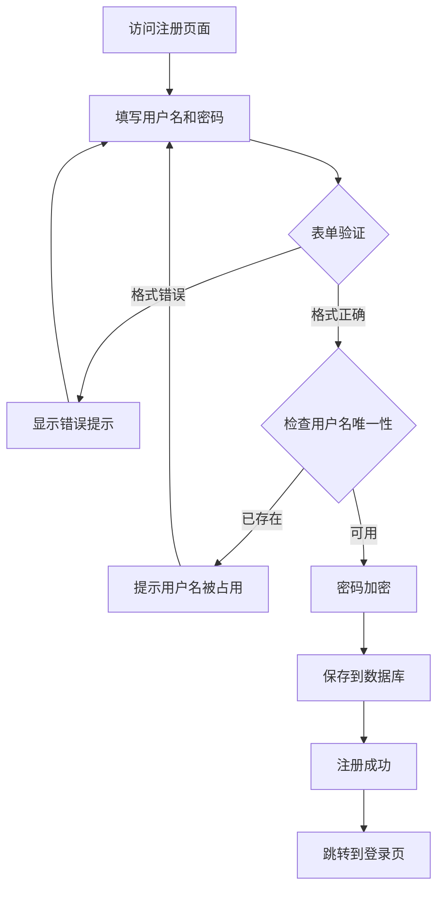

#### 业务规则

1. **用户名规则**
   - 长度：3-20 个字符
   - 字符集：中文、字母、数字、下划线
   - 唯一性：全局唯一

2. **密码规则**
   - 最小长度：6 位
   - 字符类型：不限（字母/数字/特殊字符均可）
   - 加密方式：Werkzeug password_hash

3. **异常处理**
   - 网络错误：友好提示"请稍后重试"
   - 数据库错误：记录日志，提示用户"系统繁忙"

---

### 1.2 用户登录流程

#### 流程图

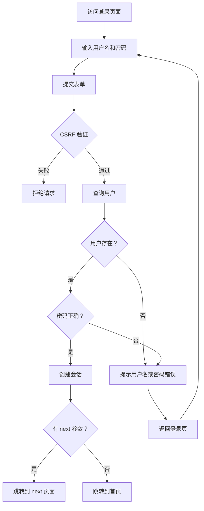

#### 业务规则

1. **安全策略**
   - 不明确指出用户名或密码错误（防枚举攻击）
   - 使用 ORM 参数化查询（防 SQL 注入）
   - Session 管理：HttpOnly Cookie

2. **会话管理**
   - 登录成功后创建 session
   - session 中保存 user_id 和 role
   - 登出时销毁 session

3. **跳转逻辑**
   - 如果有 next 参数，登录后跳转到该页面
   - 否则跳转到首页
   - 禁止跳转到外部链接（防钓鱼）

---

### 1.3 品种管理流程

#### 1.3.1 添加品种流程

```mermaid
graph TB
    A[管理员登录] --> B[访问品种管理页面]
    B --> C[点击"添加品种"]
    C --> D[填写品种信息]
    D --> E{前端验证}
    E -->|失败 | F[显示错误]
    E -->|通过 | G[提交到后端]
    G --> H{后端验证}
    H -->|失败 | I[返回错误信息]
    H -->|通过 | J{检查名称重复}
    J -->|重复 | K[提示已存在]
    J -->|不重复 | L[保存到数据库]
    L --> M[返回成功和 ID]
    M --> N[刷新列表]
    I --> D
    K --> D
    F --> D
```

#### 1.3.2 批量导入流程

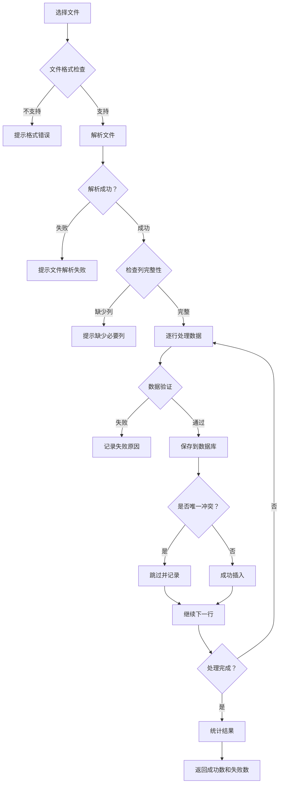

#### 业务规则

1. **数据验证**
   - 品种名：必填，2-100 字符，禁止 HTML 标签
   - 平均寿命：可选，0-100 岁，数值类型
   - 体型类别：可选，枚举值验证
   - 人气值：可选，0-1000 整数

2. **错误处理**
   - 单条失败不影响其他数据
   - 详细记录每条失败原因
   - 返回友好的错误提示

---

### 1.4 图表展示流程

#### 流程图

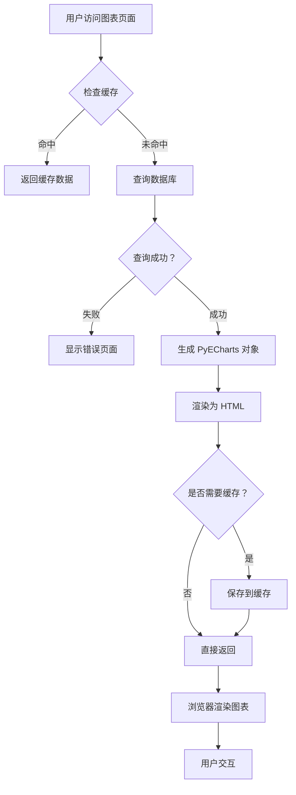

#### 缓存策略

| 图表类型 | 缓存时间 | 理由 |
|---------|---------|------|
| 世界地图 | 1 小时 | 数据量大，翻译耗时 |
| 其他图表 | 不缓存 | 数据量小，实时性好 |

---

### 1.5 数据汇总流程

#### 流程图

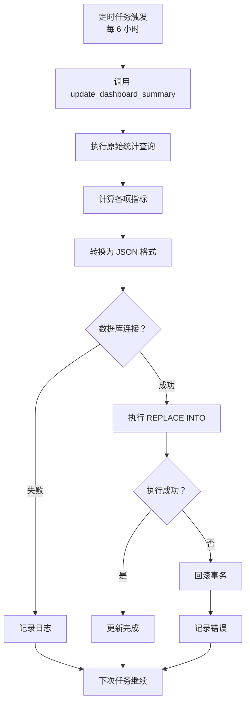

#### 汇总表结构

```sql
CREATE TABLE dashboard_summary (
    id INT PRIMARY KEY,
    total_dogs INT,              -- 狗狗总数
    avg_price DECIMAL(10,2),     -- 平均价格
    total_shops INT,             -- 店铺总数
    total_breeds INT,            -- 品种总数
    top_breeds JSON,             -- TOP5 品种
    top_shops JSON,              -- TOP5 店铺
    price_dist JSON,             -- 价格分布
    level_pet INT,               -- 宠物级数量
    level_blood INT,             -- 血统级数量
    updated_at TIMESTAMP         -- 更新时间
);
```

---

## 二、权限管理流程

### 2.1 权限模型

```
角色定义:
├─ 管理员 (role='admin')
│   ├─ 查看所有页面
│   ├─ 品种管理 (CRUD)
│   └─ 批量导入
│
└─ 普通用户 (role='user')
    ├─ 查看公开页面
    └─ 无管理权限
```

### 2.2 权限检查流程

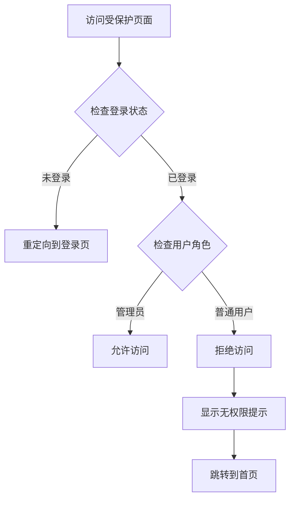

### 2.3 路由权限配置

| 路由 | 权限要求 | 说明 |
|-----|---------|------|
| GET / | 无 | 公开访问 |
| GET /chart/* | 无 | 公开访问 |
| GET /api/breeds | 无 | 公开访问 |
| POST/PUT/DELETE /api/breeds | 管理员 | 需要 admin 角色 |
| GET /admin/breeds | 管理员 | 管理后台 |
| POST /api/breeds/import | 管理员 | 批量导入 |

---

## 三、数据处理流程

### 3.1 数据来源

```
数据源
├─ jd_dogs 表 (狗狗基本信息)
│   ├─ dog_name (品种名)
│   ├─ price (价格)
│   ├─ weight (体重)
│   ├─ pet_level (级别)
│   └─ shop_name (店铺)
│
├─ dog_price 表 (价格详情)
│   └─ Origin_wool (产地)
│
└─ dog_wykl 表 (狗粮数据)
    ├─ food_name (品牌名)
    ├─ price (价格)
    └─ origin (产地)
```

### 3.2 数据统计流程

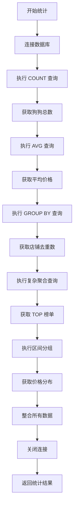

### 3.3 数据质量控制

1. **完整性检查**
   - 必填字段非空验证
   - 数值字段范围检查
   - 关联字段一致性

2. **准确性保证**
   - 使用事务保证一致性
   - 异常回滚机制
   - 数据校验日志

3. **时效性管理**
   - 定时任务自动更新
   - 缓存过期策略
   - 手动刷新接口

---

## 四、错误处理流程

### 4.1 错误分类

| 错误类型 | HTTP 状态码 | 处理方式 |
|---------|-----------|---------|
| 客户端错误 | 400 | 返回具体错误信息 |
| 未授权 | 401 | 重定向登录 |
| 禁止访问 | 403 | 显示无权限 |
| 资源不存在 | 404 | 友好提示页 |
| 服务器错误 | 500 | 记录日志，通用提示 |

### 4.2 错误处理流程

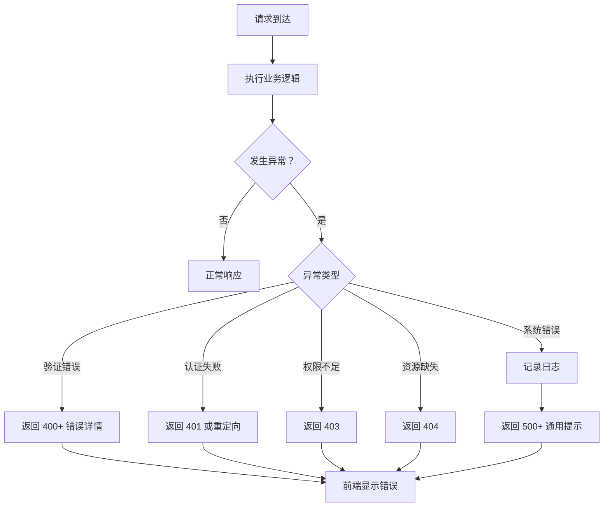

### 4.3 错误日志记录

```python
# 日志格式
{
    "timestamp": "2026-03-23 10:30:00",
    "level": "ERROR",
    "module": "app_new.py",
    "function": "add_breed",
    "message": "数据库连接失败",
    "stack_trace": "...",
    "user_id": 123,
    "request_path": "/api/breeds"
}
```

---

## 五、安全防护流程

### 5.1 CSRF 防护流程

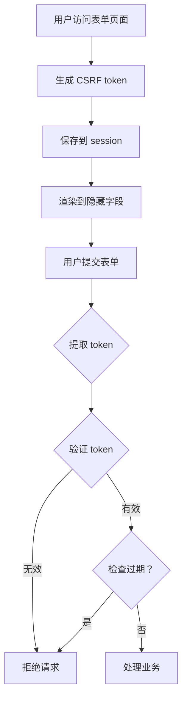

### 5.2 XSS 防护流程

```
用户输入
  ↓
过滤 HTML 标签 (正则表达式)
  ↓
转义特殊字符 (& < > " ')
  ↓
保存到数据库
  ↓
输出时 Jinja2 自动转义
  ↓
浏览器安全显示
```

### 5.3 SQL 注入防护

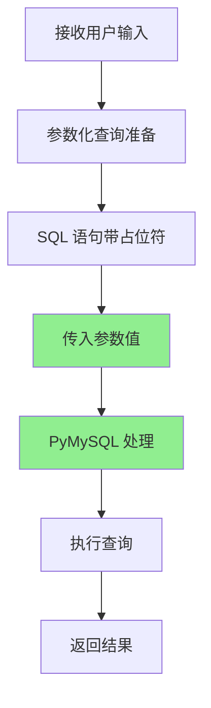

**示例对比**:

❌ **危险做法**:
```python
sql = f"SELECT * FROM users WHERE username='{username}'"
```

✅ **安全做法**:
```python
cur.execute("SELECT * FROM users WHERE username=%s", (username,))
```

---

## 六、性能优化流程

### 6.1 缓存流程

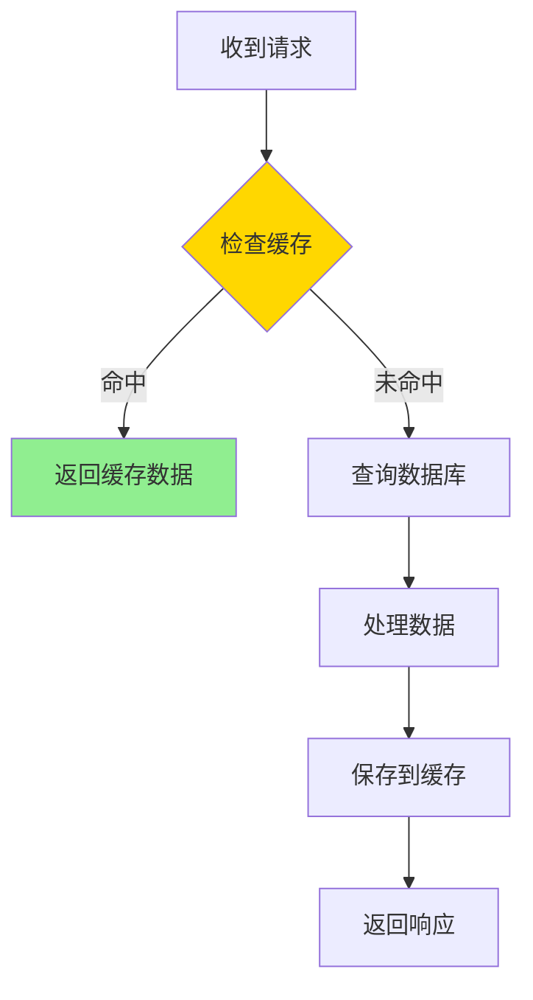

### 6.2 数据库优化

1. **索引策略**
   - 主键索引：id
   - 唯一索引：breed_name, username
   - 复合索引：常用查询组合

2. **查询优化**
   - 避免 SELECT *
   - 使用 LIMIT 限制结果数
   - 避免 N+1 查询

3. **连接池**
   - 复用数据库连接
   - 设置最大连接数
   - 空闲连接超时回收

---

## 七、部署流程

### 7.1 开发环境部署

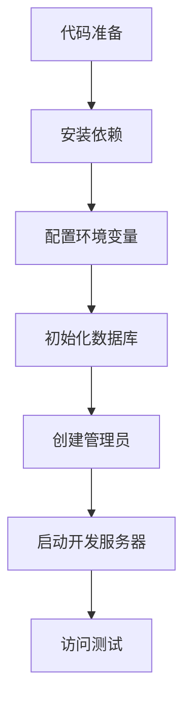

### 7.2 生产环境部署

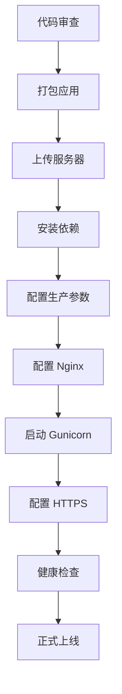

---

## 八、监控与运维流程

### 8.1 日常监控

| 监控项 | 频率 | 阈值 | 告警方式 |
|-------|------|------|---------|
| CPU 使用率 | 1 分钟 | > 80% | 邮件 |
| 内存使用率 | 1 分钟 | > 85% | 邮件 |
| 磁盘空间 | 1 小时 | > 90% | 邮件 |
| 错误日志 | 实时 | > 100 条/小时 | 短信 |
| 响应时间 | 1 分钟 | > 3 秒 | 邮件 |

### 8.2 故障处理流程

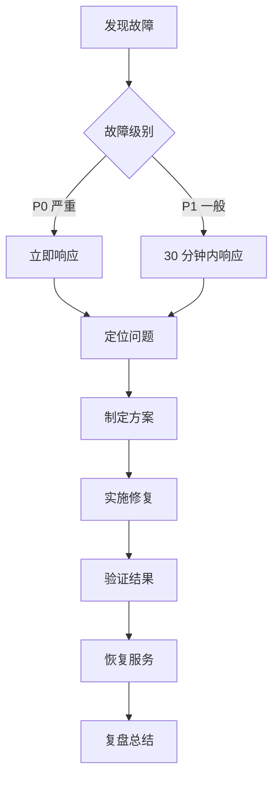

---

## 九、数据备份流程

### 9.1 备份策略

| 备份类型 | 频率 | 保留时间 | 存储位置 |
|---------|------|---------|---------|
| 全量备份 | 每天 00:00 | 7 天 | 本地 + 云端 |
| 增量备份 | 每小时 | 24 小时 | 本地 |
| 日志备份 | 实时 | 30 天 | 云端 |

### 9.2 恢复流程

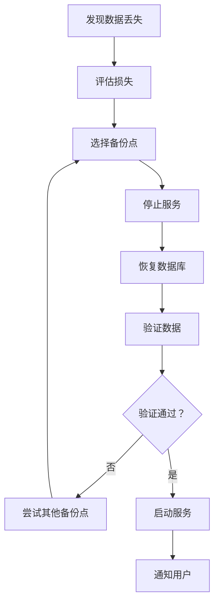

---

**文档版本**: V1.0  
**最后更新**: 2026-03-23  
**审批状态**: 待审核
