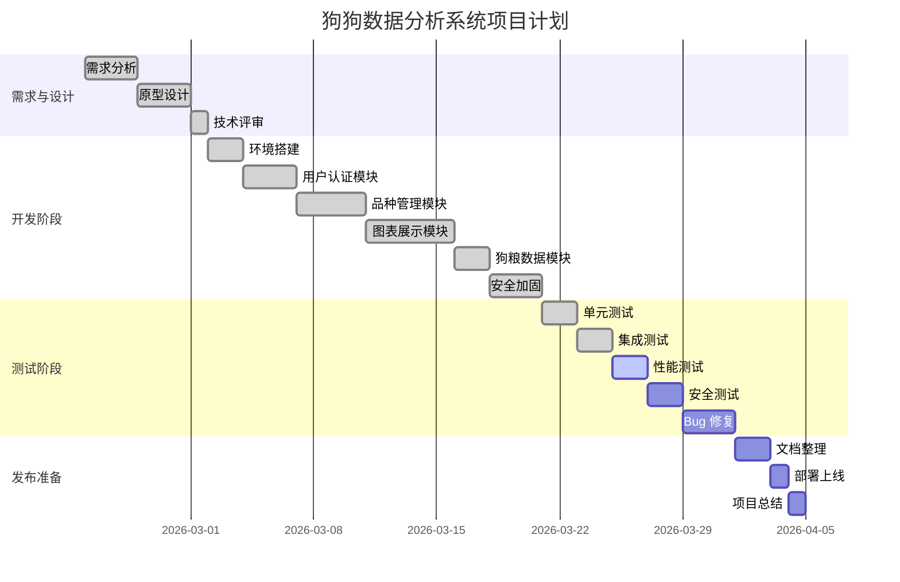
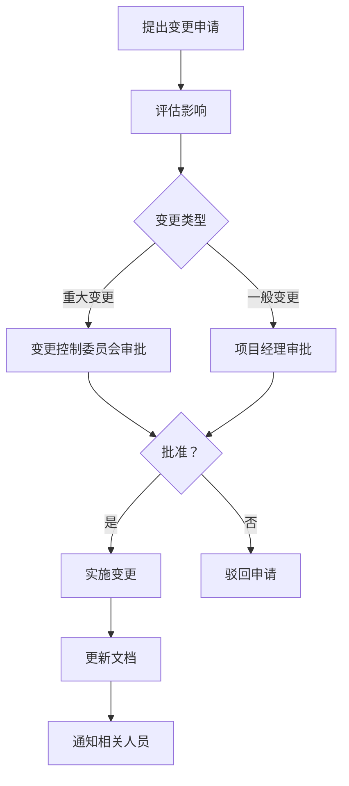

# 项目计划文档

## 文档信息

| 项目名称 | 狗狗数据分析系统 v4.3.1 |
|---------|---------------------|
| 文档版本 | v4.3.1 |
| 创建日期 | 2026-03-23 |
| 更新日期 | 2026-04-13 |
| 项目经理 | 产品团队 |
| 预计周期 | 4 周 |

---

## 一、项目概述

### 1.1 项目背景

随着宠物经济的快速发展，市场需要一款专业的狗狗数据分析工具，帮助从业者了解市场动态、价格分布和品种信息。本项目旨在构建一个功能完善、安全可靠的数据可视化平台。

### 1.2 项目目标

**业务目标**:
- 提供准确的狗狗市场数据统计
- 支持科学的购买和繁育决策
- 建立完善的品种信息管理体系

**技术目标**:
- 基于 Flask 构建稳定的后端服务
- 使用 PyECharts 实现丰富的数据可视化
- 通过严格的安全测试（SQL 注入、XSS、CSRF）
- 响应时间：首页 < 2 秒，API < 1 秒

### 1.3 项目范围

**包含内容**:
- ✅ 用户认证系统（注册、登录、权限管理）
- ✅ 数据看板（首页统计、6 种图表）
- ✅ 品种管理（CRUD、批量导入）
- ✅ 狗粮数据展示
- ✅ 安全防护机制
- ✅ 定时任务和数据缓存

**不包含内容**:
- ❌ 移动端 APP
- ❌ 数据导出功能
- ❌ 高级搜索和筛选
- ❌ 第三方系统集成

---

## 二、项目组织

### 2.1 团队结构

```
项目经理 (PM)
├─ 产品负责人 (PO)
├─ 技术负责人 (TL)
│   ├─ 后端开发 (2 人)
│   └─ 前端开发 (1 人)
├─ 测试负责人 (QA)
│   └─ 测试工程师 (1 人)
└─ UI 设计师 (兼职)
```

### 2.2 角色职责

| 角色 | 职责 | 人员 |
|-----|------|------|
| 项目经理 | 整体规划、资源协调、风险管理 | _______ |
| 产品负责人 | 需求分析、原型设计、验收 | _______ |
| 技术负责人 | 架构设计、代码审查、技术指导 | _______ |
| 后端开发 | 功能开发、单元测试、Bug 修复 | _______ |
| 前端开发 | 页面开发、交互实现、UI 优化 | _______ |
| 测试工程师 | 测试用例、执行测试、Bug 跟踪 | _______ |

---

## 三、项目进度计划

### 3.1 总体里程碑



---

### 3.2 详细任务分解

#### 第一阶段：需求与设计（第 1 周）

**Week 1: 2026-02-23 ~ 2026-03-01**

| 任务 | 负责人 | 开始日期 | 结束日期 | 交付物 | 状态 |
|-----|------|---------|---------|--------|------|
| 需求调研与分析 | PO | 02-23 | 02-24 | 需求清单 | ✅ |
| 竞品分析 | PO | 02-24 | 02-25 | 竞品分析报告 | ✅ |
| 产品原型设计 | PO+UI | 02-26 | 02-27 | 原型图 | ✅ |
| PRD 编写 | PO | 02-27 | 02-28 | PRD 文档 | ✅ |
| 技术架构设计 | TL | 02-28 | 03-01 | 架构设计文档 | ✅ |
| 需求评审 | ALL | 03-01 | 03-01 | 评审纪要 | ✅ |

**里程碑**: M1 - 需求冻结（03-01）

---

#### 第二阶段：开发阶段（第 2-3 周）

**Week 2: 2026-03-02 ~ 2026-03-08**

| 任务 | 负责人 | 开始日期 | 结束日期 | 交付物 | 状态 |
|-----|------|---------|---------|--------|------|
| 开发环境搭建 | TL | 03-02 | 03-02 | 环境配置文档 | ✅ |
| 数据库设计 | TL | 03-02 | 03-03 | ER 图、建表脚本 | ✅ |
| 用户认证模块 | Dev1 | 03-04 | 03-06 | 注册、登录、权限 | ✅ |
| 品种管理 CRUD | Dev2 | 03-04 | 03-06 | API 接口 | ✅ |
| 首页数据看板 | Dev1 | 03-07 | 03-08 | 统计功能 | ✅ |

**Week 3: 2026-03-09 ~ 2026-03-15**

| 任务 | 负责人 | 开始日期 | 结束日期 | 交付物 | 状态 |
|-----|------|---------|---------|--------|------|
| 价格散点图 | Dev1 | 03-09 | 03-10 | 图表渲染 | ✅ |
| 体重折线图 | Dev1 | 03-10 | 03-11 | 图表渲染 | ✅ |
| 级别柱状图 | Dev1 | 03-11 | 03-12 | 图表渲染 | ✅ |
| TOP10 直方图 | Dev1 | 03-12 | 03-13 | 图表渲染 | ✅ |
| 价格漏斗图 | Dev1 | 03-13 | 03-14 | 图表渲染 | ✅ |
| 世界地图 | Dev1 | 03-14 | 03-15 | 地图 + 翻译 | ✅ |
| 批量导入功能 | Dev2 | 03-09 | 03-12 | CSV/Excel导入 | ✅ |
| 狗粮数据模块 | Dev2 | 03-13 | 03-15 | 统计数据 | ✅ |

**Week 4: 2026-03-16 ~ 2026-03-22**

| 任务 | 负责人 | 开始日期 | 结束日期 | 交付物 | 状态 |
|-----|------|---------|---------|--------|------|
| CSRF 保护集成 | Dev1 | 03-16 | 03-17 | Flask-WTF | ✅ |
| XSS 防护加强 | Dev1 | 03-17 | 03-18 | 输入过滤 | ✅ |
| SQL 注入防护 | Dev2 | 03-16 | 03-17 | ORM 参数化 | ✅ |
| 定时任务 | Dev2 | 03-18 | 03-19 | 数据汇总 | ✅ |
| 缓存优化 | Dev2 | 03-19 | 03-20 | Flask-Caching | ✅ |
| 代码审查 | TL | 03-20 | 03-22 | 审查报告 | ✅ |

**里程碑**: M2 - 功能开发完成（03-22）

---

#### 第三阶段：测试阶段（第 4 周）

**Week 5: 2026-03-23 ~ 2026-03-29**

| 任务 | 负责人 | 开始日期 | 结束日期 | 交付物 | 状态 |
|-----|------|---------|---------|--------|------|
| 编写测试用例 | QA | 03-23 | 03-24 | 测试用例文档 | ✅ |
| 单元测试 | Dev | 03-23 | 03-24 | 测试报告 | ✅ |
| 集成测试 | QA | 03-25 | 03-26 | 测试报告 | 🔄 |
| 性能测试 | QA | 03-26 | 03-27 | 性能报告 | ⏳ |
| 安全测试 | QA | 03-27 | 03-28 | 安全报告 | ⏳ |
| Bug 修复 | Dev | 03-28 | 03-29 | Bug 修复记录 | ⏳ |
| 回归测试 | QA | 03-29 | 03-29 | 回归报告 | ⏳ |

**里程碑**: M3 - 测试完成（03-29）

---

#### 第四阶段：发布准备（第 5 周）

**Week 6: 2026-03-30 ~ 2026-04-05**

| 任务 | 负责人 | 开始日期 | 结束日期 | 交付物 | 状态 |
|-----|------|---------|---------|--------|------|
| 文档整理 | ALL | 03-30 | 03-31 | 完整文档集 | ⏳ |
| 部署手册编写 | TL | 03-30 | 03-31 | 部署文档 | ⏳ |
| 用户手册编写 | PO | 03-31 | 04-01 | 用户指南 | ⏳ |
| 生产环境部署 | TL | 04-02 | 04-02 | 线上环境 | ⏳ |
| 上线验证 | QA | 04-03 | 04-03 | 验收报告 | ⏳ |
| 项目总结 | PM | 04-04 | 04-05 | 总结报告 | ⏳ |

**里程碑**: M4 - 正式上线（04-03）

---

## 四、资源计划

### 4.1 人力资源

| 角色 | 人数 | 投入度 | 总工时 |
|-----|------|-------|--------|
| 项目经理 | 1 | 20% | 16 小时 |
| 产品负责人 | 1 | 50% | 40 小时 |
| 技术负责人 | 1 | 50% | 40 小时 |
| 后端开发 | 2 | 100% | 160 小时 |
| 前端开发 | 1 | 50% | 40 小时 |
| 测试工程师 | 1 | 100% | 80 小时 |
| UI 设计师 | 1 | 20% | 16 小时 |
| **总计** | - | - | **392 小时** |

### 4.2 硬件资源

| 资源类型 | 数量 | 用途 | 备注 |
|---------|------|------|------|
| 开发电脑 | 4 台 | 开发人员使用 | 已有 |
| 测试服务器 | 1 台 | 测试环境 | 8 核 16G |
| 数据库服务器 | 1 台 | MySQL | 已有 |
| 浏览器 | 3 种 | 兼容性测试 | Chrome/Firefox/Edge |

### 4.3 软件资源

| 软件 | 用途 | 许可 | 成本 |
|-----|------|------|------|
| Python 3.9 | 开发语言 | 开源 | 免费 |
| Flask | Web 框架 | 开源 | 免费 |
| MySQL 8.0 | 数据库 | 开源 | 免费 |
| pytest | 测试框架 | 开源 | 免费 |
| Selenium | UI 自动化 | 开源 | 免费 |
| Git | 版本控制 | 开源 | 免费 |

---

## 五、预算计划

### 5.1 人力成本

| 角色 | 工时 | 单价 (元/小时) | 小计 (元) |
|-----|------|--------------|---------|
| 产品经理 | 40 | 300 | 12,000 |
| 技术负责人 | 40 | 250 | 10,000 |
| 后端开发 | 160 | 200 | 32,000 |
| 前端开发 | 40 | 200 | 8,000 |
| 测试工程师 | 80 | 180 | 14,400 |
| UI 设计师 | 16 | 250 | 4,000 |
| **合计** | - | - | **80,400** |

### 5.2 其他成本

| 项目 | 金额 (元) | 说明 |
|-----|---------|------|
| 服务器租赁 | 500 | 测试环境 1 个月 |
| 域名费用 | 100 | 1 年 |
| SSL 证书 | 0 | Let's Encrypt 免费 |
| 办公分摊 | 2,000 | 水电、场地等 |
| **合计** | **2,600** | - |

### 5.3 总预算

**总预算**: 80,400 + 2,600 = **83,000 元**

**应急储备**: 83,000 × 10% = **8,300 元**

**项目总预算**: 83,000 + 8,300 = **91,300 元**

---

## 六、风险管理

### 6.1 风险识别

| 风险 ID | 风险描述 | 类别 | 可能性 | 影响 | 风险值 |
|--------|---------|------|-------|------|--------|
| R001 | 需求变更频繁 | 需求 | 中 | 高 | 高 |
| R002 | 核心人员离职 | 人力 | 低 | 高 | 中 |
| R003 | 技术难点攻克困难 | 技术 | 中 | 中 | 中 |
| R004 | 测试发现重大 Bug | 质量 | 中 | 高 | 高 |
| R005 | 服务器故障 | 环境 | 低 | 高 | 中 |
| R006 | 进度延期 | 进度 | 中 | 中 | 中 |

### 6.2 风险应对策略

**R001: 需求变更**
- **预防**: 需求评审严格把关，获得各方签字确认
- **应对**: 建立变更控制流程，评估影响后再决定
- **责任人**: PM

**R002: 人员流失**
- **预防**: 良好的团队氛围，合理的薪酬激励
- **应对**: 知识共享，AB 角备份机制
- **责任人**: PM

**R003: 技术难点**
- **预防**: 前期充分调研，技术预研
- **应对**: 寻求外部专家支持，调整技术方案
- **责任人**: TL

**R004: 重大 Bug**
- **预防**: 代码审查，单元测试
- **应对**: 预留 Buffer 时间修复，必要时延期
- **责任人**: QA

**R005: 服务器故障**
- **预防**: 定期维护，监控告警
- **应对**: 快速切换到备用环境
- **责任人**: TL

**R006: 进度延期**
- **预防**: 详细的进度计划，每日站会跟踪
- **应对**: 加班赶工，削减非核心功能
- **责任人**: PM

---

## 七、沟通计划

### 7.1 会议安排

| 会议 | 频率 | 时间 | 参与人 | 时长 |
|-----|------|------|--------|------|
| 项目启动会 | 一次性 | 周一 9:00 | 全体 | 1 小时 |
| 每日站会 | 每天 | 9:00-9:15 | 开发 + 测试 | 15 分钟 |
| 周例会 | 每周 | 周五 14:00 | 全体 | 1 小时 |
| 技术评审会 | 按需 | 待定 | 开发 | 2 小时 |
| 阶段评审会 | 里程碑 | 待定 | 管理层 + 全体 | 2 小时 |

### 7.2 沟通渠道

| 用途 | 工具 | 说明 |
|-----|------|------|
| 即时沟通 | 企业微信/钉钉 | 日常交流 |
| 邮件 | Outlook | 正式通知 |
| 文档协作 | 语雀/Notion | 文档管理 |
| 代码管理 | GitLab/GitHub | 代码托管 |
| 任务管理 | Jira/Trello | 任务跟踪 |
| Bug 跟踪 | Jira | 缺陷管理 |

### 7.3 报告机制

| 报告 | 频率 | 接收人 | 内容 |
|-----|------|--------|------|
| 日报 | 每天 | 项目组 | 今日完成、明日计划、问题 |
| 周报 | 每周五 | 管理层 | 进度、风险、下周计划 |
| 里程碑报告 | 每个里程碑 | 管理层 + 客户 | 阶段成果、问题总结 |
| 质量报告 | 每周 | 项目组 | Bug 统计、测试结果 |

---

## 八、质量保证计划

### 8.1 质量目标

| 指标 | 目标值 | 测量方法 |
|-----|-------|---------|
| 代码覆盖率 | ≥ 80% | pytest-cov |
| Bug 密度 | < 5 个/KLOC | Bug 数/代码行数 |
| 严重 Bug 数 | 0 | 上线前清零 |
| 测试通过率 | ≥ 95% | 通过用例/总用例 |
| 代码审查覆盖率 | 100% | 审查记录 |

### 8.2 质量控制活动

**代码审查**:
- 所有代码必须经过审查才能合并
- 审查重点：逻辑正确性、安全性、性能、规范
- 工具：GitLab Merge Request

**测试策略**:
- 单元测试：开发人员负责，覆盖率 ≥ 80%
- 集成测试：测试人员负责，覆盖核心流程
- 性能测试：关键接口压力测试
- 安全测试：渗透测试 + 代码扫描

**持续集成**:
- 每次提交自动触发构建
- 自动运行单元测试
- 自动生成测试报告

---

## 九、变更管理

### 9.1 变更流程



### 9.2 变更控制委员会

| 角色 | 人员 | 职责 |
|-----|------|------|
| 主席 | PM | 最终决策 |
| 成员 | PO | 评估业务影响 |
| 成员 | TL | 评估技术可行性 |
| 成员 | QA | 评估质量风险 |

---

## 十、项目收尾

### 10.1 交付物清单

**文档类**:
- [x] 产品需求文档
- [x] 产品设计原型
- [x] 业务流程文档
- [x] 验收标准文档
- [x] API 接口文档
- [x] 开发文档
- [x] 测试计划
- [x] 测试用例
- [ ] 部署手册
- [ ] 用户手册
- [ ] 项目总结报告

**代码类**:
- [x] 源代码
- [x] 数据库脚本
- [x] 配置文件
- [x] 测试脚本

**其他**:
- [ ] 培训材料
- [ ] 运维手册
- [ ] 常见问题 FAQ

### 10.2 验收标准

- ✅ 所有功能按需求实现
- ✅ 性能指标达标
- ✅ 无 Critical 和 Major Bug
- ✅ 文档齐全
- ✅ 代码审查通过
- ✅ 安全测试通过

### 10.3 经验教训总结

**模板**:

```
一、做得好的地方
1. ...
2. ...

二、需要改进的地方
1. ...
2. ...

三、建议
1. ...
2. ...
```

---

## 十一、附录

### 11.1 术语表

| 术语 | 定义 |
|-----|------|
| PRD | Product Requirement Document，产品需求文档 |
| MVP | Minimum Viable Product，最小可行产品 |
| CRUD | Create, Read, Update, Delete，增删改查 |
| API | Application Programming Interface，应用程序接口 |
| Bug | 软件缺陷或错误 |
| KLOC | Thousand Lines of Code，千行代码 |

### 11.2 参考资料

- Flask 官方文档：https://flask.palletsprojects.com/
- PyECharts 官方文档：https://pyecharts.org/
- 项目管理知识体系指南（PMBOK）

---

**文档审批**:

| 角色 | 姓名 | 签字 | 日期 |
|-----|------|------|------|
| 项目经理 | _______ | _______ | _______ |
| 产品负责人 | _______ | _______ | _______ |
| 技术负责人 | _______ | _______ | _______ |

---

**文档版本**: V1.0  
**最后更新**: 2026-03-23  
**状态**: 已发布
