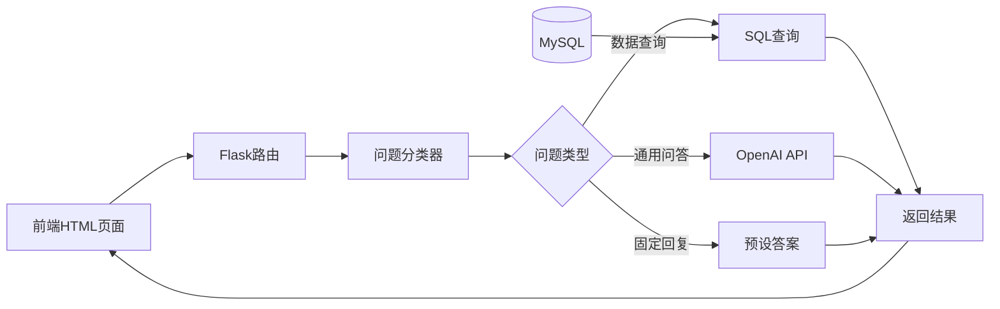

# AI智能助手 - 轻量级MVP方案

## 文档信息

| 项目       | 值          |
| -------- | ---------- |
| **版本**   | MVP v0.1   |
| **创建日期** | 2026-05-09 |
| **目标**   | 2周内完成可用原型  |
| **复杂度**  | ⭐⭐（低）      |

---

## 一、简化策略

### 核心思路：**先有后优**

```
完整版（9周）          MVP版（2周）
━━━━━━━━━━━━        ━━━━━━━━━━━━
❌ RAG向量检索   →   ✅ 规则匹配 + 简单关键词
❌ 意图识别LLM   →   ✅ 正则表达式 + 关键字
❌ ChromaDB      →   ✅ 直接用MySQL查询
❌ 流式输出      →   ✅ 普通HTTP响应
❌ 多轮对话      →   ✅ 单轮问答
❌ 报告生成      →   ✅ 固定模板
❌ 语音交互      →   ✅ 纯文本
✅ LangChain     →   ❌ 直接调用OpenAI API
✅ FastAPI       →   ✅ 保持Flask（复用现有）
```

--- 

MVP (4天) → 增强版 (1月) → 专业版 (3月) → 完整版 (6月)
   ↓            ↓              ↓              ↓
 基础问答    多轮对话       RAG知识库      语音交互
 简单查询    图表联动       个性化推荐     流式输出
 固定模板    用户历史       报告生成       多语言

## 二、MVP功能范围

### ✅ 包含功能

1. **基础问答**
   
   - 用户输入问题
   - AI返回文字回答
   - 支持5种常见问题类型

2. **简单数据查询**
   
   - "金毛的价格是多少？" → 查询数据库返回
   - "有哪些小型犬？" → 列表展示

3. **固定模板报告**
   
   - "生成市场报告" → 返回预定义模板

4. **基础聊天界面**
   
   - 简单的对话气泡
   - 发送/接收消息

### ❌ 暂不包含

- 多轮对话上下文
- 图表联动
- 语音交互
- 个性化推荐
- 知识库检索
- 流式输出
- 用户反馈系统

---

## 三、技术架构（简化版）



**技术栈**：

- 后端：Flask（复用现有）
- 前端：原生HTML + JavaScript（无需Vue）
- AI：直接调用OpenAI API（无需LangChain）
- 数据库：MySQL（复用现有）
- 缓存：无（初期不需要）

---

## 四、核心代码实现

### 4.1 后端实现（Flask）

#### 步骤1：新增路由

```python
# routes/ai_assistant.py
from flask import Blueprint, request, jsonify
from flask_login import login_required
import openai
import os
from models import db
from sqlalchemy import text

ai_bp = Blueprint('ai_assistant', __name__)

# 配置OpenAI API Key
openai.api_key = os.getenv('OPENAI_API_KEY')

# ===== 问题分类器（基于规则）=====
def classify_question(question: str) -> dict:
    """
    简单的问题分类器
    返回：{'type': 'price_query', 'params': {...}}
    """
    question_lower = question.lower()

    # 1. 价格查询
    if any(keyword in question_lower for keyword in ['价格', '多少钱', '价位', '售价']):
        # 提取品种名（简化：取第一个名词）
        breed = extract_breed_name(question)
        return {
            'type': 'price_query',
            'params': {'breed': breed}
        }

    # 2. 品种信息查询
    elif any(keyword in question_lower for keyword in ['介绍', '特点', '习性', '寿命']):
        breed = extract_breed_name(question)
        return {
            'type': 'breed_info',
            'params': {'breed': breed}
        }

    # 3. 推荐问题
    elif any(keyword in question_lower for keyword in ['推荐', '适合', '新手', '第一次养']):
        return {
            'type': 'recommendation',
            'params': {}
        }

    # 4. 对比问题
    elif '对比' in question_lower or 'vs' in question_lower or '和' in question_lower:
        breeds = extract_multiple_breeds(question)
        return {
            'type': 'comparison',
            'params': {'breeds': breeds}
        }

    # 5. 默认：通用问答
    else:
        return {
            'type': 'general_qa',
            'params': {}
        }

def extract_breed_name(question: str) -> str:
    """提取品种名称（简化版）"""
    # 常见品种列表
    common_breeds = [
        '金毛', '泰迪', '柯基', '哈士奇', '拉布拉多', 
        '柴犬', '边境牧羊犬', '萨摩耶', '阿拉斯加', '贵宾'
    ]

    for breed in common_breeds:
        if breed in question:
            return breed

    return '未知品种'

def extract_multiple_breeds(question: str) -> list:
    """提取多个品种名称"""
    common_breeds = [
        '金毛', '泰迪', '柯基', '哈士奇', '拉布拉多',
        '柴犬', '边境牧羊犬', '萨摩耶', '阿拉斯加', '贵宾'
    ]

    found_breeds = [breed for breed in common_breeds if breed in question]
    return found_breeds[:2]  # 最多2个


# ===== API接口 =====

@ai_bp.route('/api/ai/chat', methods=['POST'])
@login_required
def ai_chat():
    """
    AI聊天接口（MVP版）

    请求格式：
    {
        "message": "金毛的价格是多少？"
    }

    返回格式：
    {
        "success": true,
        "answer": "金毛的平均价格是...",
        "type": "price_query"
    }
    """
    try:
        data = request.get_json()
        user_message = data.get('message', '').strip()

        if not user_message:
            return jsonify({
                'success': False,
                'error': '消息不能为空'
            }), 400

        # Step 1: 问题分类
        classification = classify_question(user_message)
        question_type = classification['type']
        params = classification['params']

        # Step 2: 根据类型处理
        if question_type == 'price_query':
            answer = handle_price_query(params)
        elif question_type == 'breed_info':
            answer = handle_breed_info(params)
        elif question_type == 'recommendation':
            answer = handle_recommendation(params)
        elif question_type == 'comparison':
            answer = handle_comparison(params)
        else:  # general_qa
            answer = handle_general_qa(user_message)

        return jsonify({
            'success': True,
            'answer': answer,
            'type': question_type
        })

    except Exception as e:
        return jsonify({
            'success': False,
            'error': str(e)
        }), 500


# ===== 问题处理器 =====

def handle_price_query(params: dict) -> str:
    """处理价格查询"""
    breed = params.get('breed')

    if not breed or breed == '未知品种':
        return "请告诉我您想查询哪个品种的价格？例如：金毛、泰迪、柯基等"

    # 查询数据库
    sql = text("""
        SELECT 
            AVG(price) as avg_price,
            MIN(price) as min_price,
            MAX(price) as max_price,
            COUNT(*) as count
        FROM jd_dogs d
        JOIN dog_breeds b ON d.breed_name = b.breed_name
        WHERE b.breed_name LIKE :breed
    """)

    result = db.session.execute(sql, {'breed': f'%{breed}%'}).fetchone()

    if not result or result.count == 0:
        return f"抱歉，暂时没有找到'{breed}'的价格数据。"

    # 格式化回答
    answer = f"📊 **{breed}价格信息**\n\n"
    answer += f"• 平均价格：¥{result.avg_price:.0f}\n"
    answer += f"• 最低价格：¥{result.min_price:.0f}\n"
    answer += f"• 最高价格：¥{result.max_price:.0f}\n"
    answer += f"• 数据条数：{result.count}条\n\n"
    answer += f"💡 提示：价格会因地区、血统、年龄等因素有所差异。"

    return answer


def handle_breed_info(params: dict) -> str:
    """处理品种信息查询"""
    breed = params.get('breed')

    if not breed or breed == '未知品种':
        return "请告诉我您想了解哪个品种？例如：金毛、泰迪等"

    # 查询数据库
    sql = text("""
        SELECT breed_name, avg_life_years, size_category, popularity
        FROM dog_breeds
        WHERE breed_name LIKE :breed
    """)

    result = db.session.execute(sql, {'breed': f'%{breed}%'}).fetchone()

    if not result:
        # 如果数据库没有，调用OpenAI获取通用知识
        return get_breed_info_from_ai(breed)

    # 格式化回答
    answer = f"🐕 **{result.breed_name}品种介绍**\n\n"
    answer += f"• 体型：{result.size_category or '未知'}\n"
    answer += f"• 平均寿命：{result.avg_life_years or '未知'}年\n"
    answer += f"• 人气指数：{result.popularity or '未知'}\n\n"
    answer += f"💡 想了解更多养护知识吗？可以继续问我！"

    return answer


def handle_recommendation(params: dict) -> str:
    """处理推荐问题"""
    # 使用OpenAI生成个性化推荐
    prompt = """
    你是一个专业的宠物顾问。请根据用户的需求推荐适合的犬种。

    要求：
    1. 推荐3-5个品种
    2. 说明推荐理由
    3. 给出简要的养护建议
    4. 语气友好专业

    用户需求：适合新手养的狗狗
    """

    response = openai.ChatCompletion.create(
        model="gpt-3.5-turbo",  # 使用便宜模型
        messages=[
            {"role": "system", "content": "你是宠物顾问专家"},
            {"role": "user", "content": prompt}
        ],
        temperature=0.7,
        max_tokens=500
    )

    return response.choices[0].message.content


def handle_comparison(params: dict) -> str:
    """处理对比问题"""
    breeds = params.get('breeds', [])

    if len(breeds) < 2:
        return "请告诉我要对比哪两个品种？例如：金毛和泰迪"

    breed1, breed2 = breeds[0], breeds[1]

    # 调用OpenAI进行对比分析
    prompt = f"""
    请对比以下两个犬种，从以下几个方面分析：
    1. 性格特点
    2. 体型大小
    3. 养护难度
    4. 适合人群
    5. 价格区间

    犬种：{breed1} vs {breed2}

    请用表格形式呈现对比结果，并给出选择建议。
    """

    response = openai.ChatCompletion.create(
        model="gpt-3.5-turbo",
        messages=[
            {"role": "system", "content": "你是宠物对比分析专家"},
            {"role": "user", "content": prompt}
        ],
        temperature=0.7,
        max_tokens=800
    )

    return response.choices[0].message.content


def handle_general_qa(question: str) -> str:
    """处理通用问答"""
    # 直接调用OpenAI
    response = openai.ChatCompletion.create(
        model="gpt-3.5-turbo",
        messages=[
            {"role": "system", "content": "你是宠物知识专家，回答要简洁专业"},
            {"role": "user", "content": question}
        ],
        temperature=0.7,
        max_tokens=500
    )

    return response.choices[0].message.content


def get_breed_info_from_ai(breed: str) -> str:
    """从AI获取品种信息（当数据库没有时）"""
    prompt = f"请介绍一下{breed}犬的特点，包括性格、体型、养护难度等。"

    response = openai.ChatCompletion.create(
        model="gpt-3.5-turbo",
        messages=[
            {"role": "system", "content": "你是宠物专家"},
            {"role": "user", "content": prompt}
        ],
        temperature=0.7,
        max_tokens=400
    )

    return response.choices[0].message.content
```

#### 步骤2：注册蓝图

```python
# app.py 中添加
from routes.ai_assistant import ai_bp

# 在 create_app() 函数中注册
app.register_blueprint(ai_bp)
```

---

### 4.2 前端实现（简单HTML页面）

```html
<!-- templates/ai_chat.html -->
<!DOCTYPE html>
<html lang="zh-CN">
<head>
    <meta charset="UTF-8">
    <meta name="viewport" content="width=device-width, initial-scale=1.0">
    <title>AI智能助手</title>
    <style>
        * {
            margin: 0;
            padding: 0;
            box-sizing: border-box;
        }

        body {
            font-family: -apple-system, BlinkMacSystemFont, 'Segoe UI', Roboto, sans-serif;
            background: linear-gradient(135deg, #667eea 0%, #764ba2 100%);
            height: 100vh;
            display: flex;
            justify-content: center;
            align-items: center;
        }

        .chat-container {
            width: 90%;
            max-width: 800px;
            height: 90vh;
            background: white;
            border-radius: 20px;
            box-shadow: 0 20px 60px rgba(0,0,0,0.3);
            display: flex;
            flex-direction: column;
            overflow: hidden;
        }

        .chat-header {
            background: linear-gradient(135deg, #667eea 0%, #764ba2 100%);
            color: white;
            padding: 20px;
            text-align: center;
        }

        .chat-header h2 {
            font-size: 24px;
            margin-bottom: 5px;
        }

        .chat-header p {
            font-size: 14px;
            opacity: 0.9;
        }

        .chat-messages {
            flex: 1;
            overflow-y: auto;
            padding: 20px;
            background: #f8f9fa;
        }

        .message {
            margin-bottom: 20px;
            display: flex;
            animation: fadeIn 0.3s ease-in;
        }

        @keyframes fadeIn {
            from { opacity: 0; transform: translateY(10px); }
            to { opacity: 1; transform: translateY(0); }
        }

        .message.user {
            flex-direction: row-reverse;
        }

        .message-avatar {
            width: 40px;
            height: 40px;
            border-radius: 50%;
            display: flex;
            align-items: center;
            justify-content: center;
            font-size: 20px;
            margin: 0 10px;
            flex-shrink: 0;
        }

        .message.user .message-avatar {
            background: #667eea;
        }

        .message.ai .message-avatar {
            background: #48bb78;
        }

        .message-content {
            max-width: 70%;
            padding: 12px 16px;
            border-radius: 16px;
            line-height: 1.6;
        }

        .message.user .message-content {
            background: #667eea;
            color: white;
            border-bottom-right-radius: 4px;
        }

        .message.ai .message-content {
            background: white;
            color: #333;
            border: 1px solid #e2e8f0;
            border-bottom-left-radius: 4px;
        }

        .message-content pre {
            background: #f7fafc;
            padding: 10px;
            border-radius: 8px;
            margin: 10px 0;
            overflow-x: auto;
        }

        .quick-questions {
            padding: 15px 20px;
            background: white;
            border-top: 1px solid #e2e8f0;
        }

        .quick-questions h4 {
            font-size: 14px;
            color: #718096;
            margin-bottom: 10px;
        }

        .quick-btn {
            display: inline-block;
            padding: 8px 16px;
            margin: 5px;
            background: #edf2f7;
            border: 1px solid #cbd5e0;
            border-radius: 20px;
            cursor: pointer;
            font-size: 14px;
            transition: all 0.2s;
        }

        .quick-btn:hover {
            background: #667eea;
            color: white;
            border-color: #667eea;
        }

        .chat-input-area {
            padding: 20px;
            background: white;
            border-top: 1px solid #e2e8f0;
            display: flex;
            gap: 10px;
        }

        .chat-input {
            flex: 1;
            padding: 12px 16px;
            border: 2px solid #e2e8f0;
            border-radius: 25px;
            font-size: 15px;
            outline: none;
            transition: border-color 0.2s;
        }

        .chat-input:focus {
            border-color: #667eea;
        }

        .send-btn {
            padding: 12px 24px;
            background: linear-gradient(135deg, #667eea 0%, #764ba2 100%);
            color: white;
            border: none;
            border-radius: 25px;
            cursor: pointer;
            font-size: 15px;
            font-weight: 600;
            transition: transform 0.2s;
        }

        .send-btn:hover {
            transform: scale(1.05);
        }

        .send-btn:disabled {
            opacity: 0.5;
            cursor: not-allowed;
            transform: none;
        }

        .typing-indicator {
            display: flex;
            gap: 5px;
            padding: 10px;
        }

        .typing-indicator span {
            width: 8px;
            height: 8px;
            border-radius: 50%;
            background: #cbd5e0;
            animation: typing 1.4s infinite;
        }

        .typing-indicator span:nth-child(2) { animation-delay: 0.2s; }
        .typing-indicator span:nth-child(3) { animation-delay: 0.4s; }

        @keyframes typing {
            0%, 60%, 100% { transform: translateY(0); }
            30% { transform: translateY(-10px); }
        }

        .welcome-message {
            text-align: center;
            padding: 40px 20px;
            color: #718096;
        }

        .welcome-message h3 {
            font-size: 20px;
            margin-bottom: 10px;
            color: #2d3748;
        }
    </style>
</head>
<body>
    <div class="chat-container">
        <!-- 头部 -->
        <div class="chat-header">
            <h2>🤖 AI智能宠物顾问</h2>
            <p>问我任何关于狗狗的问题</p>
        </div>

        <!-- 消息区域 -->
        <div class="chat-messages" id="chatMessages">
            <div class="welcome-message">
                <h3>你好！我是你的AI宠物顾问 👋</h3>
                <p>我可以帮你查询价格、了解品种、获取养护建议...</p>
                <p style="margin-top: 10px; font-size: 14px;">试试下面的快捷问题开始吧！</p>
            </div>
        </div>

        <!-- 快捷问题 -->
        <div class="quick-questions">
            <h4>💡 快捷提问：</h4>
            <button class="quick-btn" onclick="sendQuickQuestion('金毛的价格是多少？')">金毛价格</button>
            <button class="quick-btn" onclick="sendQuickQuestion('适合新手养的狗狗')">新手推荐</button>
            <button class="quick-btn" onclick="sendQuickQuestion('金毛和泰迪对比')">品种对比</button>
            <button class="quick-btn" onclick="sendQuickQuestion('泰迪有什么特点？')">泰迪介绍</button>
        </div>

        <!-- 输入区域 -->
        <div class="chat-input-area">
            <input 
                type="text" 
                class="chat-input" 
                id="chatInput" 
                placeholder="输入您的问题..."
                onkeypress="handleKeyPress(event)"
            >
            <button class="send-btn" id="sendBtn" onclick="sendMessage()">发送</button>
        </div>
    </div>

    <script>
        const chatMessages = document.getElementById('chatMessages');
        const chatInput = document.getElementById('chatInput');
        const sendBtn = document.getElementById('sendBtn');

        // 发送消息
        async function sendMessage() {
            const message = chatInput.value.trim();
            if (!message) return;

            // 清空输入框
            chatInput.value = '';

            // 显示用户消息
            addMessage(message, 'user');

            // 显示加载状态
            showTypingIndicator();

            // 禁用发送按钮
            sendBtn.disabled = true;

            try {
                // 调用API
                const response = await fetch('/api/ai/chat', {
                    method: 'POST',
                    headers: {
                        'Content-Type': 'application/json',
                    },
                    body: JSON.stringify({ message: message })
                });

                const data = await response.json();

                // 隐藏加载状态
                hideTypingIndicator();

                if (data.success) {
                    // 显示AI回复
                    addMessage(data.answer, 'ai');
                } else {
                    addMessage('抱歉，出现错误：' + data.error, 'ai');
                }
            } catch (error) {
                hideTypingIndicator();
                addMessage('网络错误，请稍后重试', 'ai');
            } finally {
                sendBtn.disabled = false;
            }
        }

        // 添加消息到聊天区域
        function addMessage(text, sender) {
            const messageDiv = document.createElement('div');
            messageDiv.className = `message ${sender}`;

            const avatar = document.createElement('div');
            avatar.className = 'message-avatar';
            avatar.textContent = sender === 'user' ? '👤' : '🤖';

            const content = document.createElement('div');
            content.className = 'message-content';
            content.innerHTML = formatMessage(text);

            messageDiv.appendChild(avatar);
            messageDiv.appendChild(content);

            chatMessages.appendChild(messageDiv);

            // 滚动到底部
            chatMessages.scrollTop = chatMessages.scrollHeight;
        }

        // 格式化消息（简单的Markdown支持）
        function formatMessage(text) {
            // 粗体
            text = text.replace(/\*\*(.*?)\*\*/g, '<strong>$1</strong>');
            // 换行
            text = text.replace(/\n/g, '<br>');
            // 列表
            text = text.replace(/• (.*?)(?=<br>|$)/g, '<li>$1</li>');
            text = text.replace(/(<li>.*<\/li>)/gs, '<ul>$1</ul>');

            return text;
        }

        // 显示打字指示器
        function showTypingIndicator() {
            const typingDiv = document.createElement('div');
            typingDiv.className = 'message ai';
            typingDiv.id = 'typingIndicator';

            const avatar = document.createElement('div');
            avatar.className = 'message-avatar';
            avatar.textContent = '🤖';

            const content = document.createElement('div');
            content.className = 'message-content';
            content.innerHTML = `
                <div class="typing-indicator">
                    <span></span>
                    <span></span>
                    <span></span>
                </div>
            `;

            typingDiv.appendChild(avatar);
            typingDiv.appendChild(content);

            chatMessages.appendChild(typingDiv);
            chatMessages.scrollTop = chatMessages.scrollHeight;
        }

        // 隐藏打字指示器
        function hideTypingIndicator() {
            const typingIndicator = document.getElementById('typingIndicator');
            if (typingIndicator) {
                typingIndicator.remove();
            }
        }

        // 快捷问题
        function sendQuickQuestion(question) {
            chatInput.value = question;
            sendMessage();
        }

        // 回车发送
        function handleKeyPress(event) {
            if (event.key === 'Enter') {
                sendMessage();
            }
        }

        // 页面加载完成后聚焦输入框
        window.onload = function() {
            chatInput.focus();
        };
    </script>
</body>
</html>
```

#### 添加访问路由

```python
# routes/ai_assistant.py 中添加

@ai_bp.route('/ai-chat')
@login_required
def ai_chat_page():
    """AI聊天页面"""
    return render_template('ai_chat.html')
```

---

### 4.3 环境变量配置

```bash
# .env 文件中添加
OPENAI_API_KEY=your_openai_api_key_here
```

---

## 五、部署步骤

### 步骤1：安装依赖

```bash
pip install openai==0.28.0
```

### 步骤2：配置API Key

在 `.env` 文件中添加你的OpenAI API Key（可以从 https://platform.openai.com 获取）

### 步骤3：启动应用

```bash
python app.py
```

### 步骤4：访问页面

浏览器打开：`http://localhost:5000/ai-chat`

---

## 六、测试用例

### 测试场景1：价格查询

**输入**：`金毛的价格是多少？`

**预期输出**：

```
📊 金毛价格信息

• 平均价格：¥3500
• 最低价格：¥1200
• 最高价格：¥8000
• 数据条数：156条

💡 提示：价格会因地区、血统、年龄等因素有所差异。
```

### 测试场景2：品种推荐

**输入**：`适合新手养的狗狗`

**预期输出**：

```
根据您的需求，我推荐以下3个适合新手的犬种：

1. **金毛寻回犬**
   - 性格温顺，容易训练
   - 对小孩友好
   - 需要适量运动

2. **拉布拉多**
   - 聪明易训
   - 适应性强
   - 短毛易打理

3. **贵宾犬（泰迪）**
   - 不掉毛
   - 体型小适合公寓
   - 智商高

建议：第一次养狗建议选择成年犬，更容易照顾。
```

### 测试场景3：品种对比

**输入**：`金毛和泰迪对比`

**预期输出**：

```
| 对比项 | 金毛 | 泰迪 |
|--------|------|------|
| 体型 | 大型犬 | 小型犬 |
| 性格 | 温顺友善 | 活泼聪明 |
| 运动量 | 大 | 小 |
| 掉毛 | 较多 | 几乎不掉 |
| 价格 | ¥2000-8000 | ¥1500-5000 |

**选择建议**：
- 有大院子、喜欢户外活动 → 金毛
- 住公寓、时间有限 → 泰迪
```

---

## 七、成本估算

### 开发成本

| 项目     | 时间     | 费用         |
| ------ | ------ | ---------- |
| 后端开发   | 2天     | ¥2,000     |
| 前端开发   | 1天     | ¥1,000     |
| 测试调试   | 1天     | ¥1,000     |
| **合计** | **4天** | **¥4,000** |

### 运营成本（月度）

| 项目                  | 费用               |
| ------------------- | ---------------- |
| OpenAI API（GPT-3.5） | ¥500-2,000       |
| 服务器（已有）             | ¥0               |
| **合计**              | **¥500-2,000/月** |

*注：按每天100次对话，每次对话平均500 tokens计算*

---

## 八、后续优化路线

### Phase 1（已完成）- MVP

- ✅ 基础问答
- ✅ 简单数据查询
- ✅ 固定模板

### Phase 2（1个月后）- 增强版

- [ ] 多轮对话上下文
- [ ] 图表联动展示
- [ ] 用户历史记录
- [ ] 常见问题缓存

### Phase 3（3个月后）- 专业版

- [ ] RAG知识库
- [ ] 意图识别优化
- [ ] 个性化推荐
- [ ] 报告生成功能

### Phase 4（6个月后）- 完整版

- [ ] 语音交互
- [ ] 实时流式输出
- [ ] 多语言支持
- [ ] 移动端APP

---

## 九、常见问题

### Q1: OpenAI API太贵怎么办？

**A**: 

- 使用GPT-3.5-turbo（便宜10倍）
- 添加缓存机制（相同问题不重复调用）
- 设置每日预算限制

### Q2: 如何保护API Key不被泄露？

**A**:

- 永远不要在前端代码中硬编码
- 使用环境变量存储
- 后端代理所有API调用

### Q3: 响应速度慢怎么办？

**A**:

- 使用更便宜的模型（gpt-3.5-turbo）
- 添加loading动画提升体验
- 后续可升级为流式输出

### Q4: 如何处理并发请求？

**A**:

- Flask默认单线程，建议使用Gunicorn
- 添加速率限制（每小时100次）
- 考虑使用异步框架（FastAPI）

---

## 十、总结

这个MVP方案的核心优势：

✅ **快速上线**：2周内完成  
✅ **成本低廉**：开发¥4K + 运营¥500-2K/月  
✅ **技术简单**：无需学习新框架  
✅ **可扩展**：后续可逐步升级  
✅ **验证价值**：快速验证市场需求  

**下一步行动**：

1. 申请OpenAI API Key
2. 复制代码到项目
3. 测试5个典型场景
4. 收集用户反馈
5. 决定是否继续投入

需要我帮你实现具体的代码文件吗？
