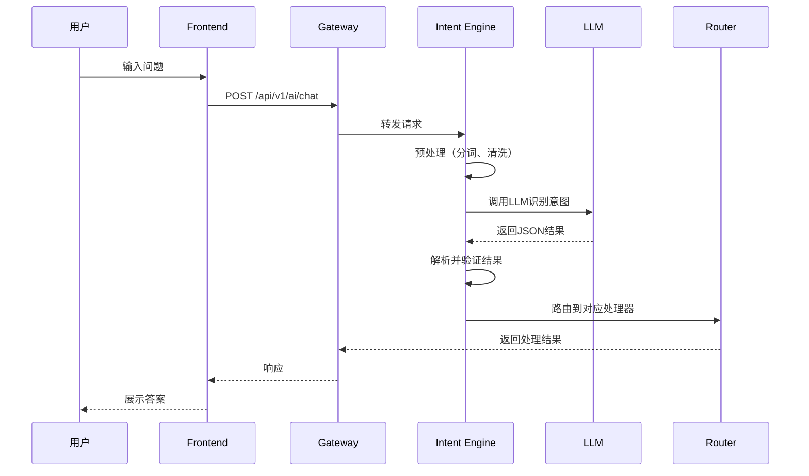
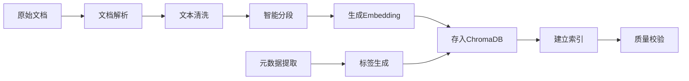

# AI智能助手技术实现方案

## 文档信息

| 项目 | 值 |
|------|-----|
| **文档名称** | AI智能助手技术实现方案 |
| **版本** | v1.0.0 |
| **创建日期** | 2026-05-09 |
| **作者** | 技术团队 |
| **状态** | 待评审 |

---

## 一、技术架构总览

### 1.1 系统架构图

```mermaid
graph TB
    subgraph "客户端层"
        A[Web前端<br/>Vue 3 + TS]
        B[移动端APP<br/>Flutter]
        C[微信小程序]
    end
    
    subgraph "网关层"
        D[Nginx负载均衡]
        E[API Gateway<br/>Kong/Traefik]
        F[限流熔断<br/>Rate Limiter]
    end
    
    subgraph "应用服务层"
        G[FastAPI主服务]
        H[对话管理服务]
        I[意图识别服务]
        J[数据查询服务]
        K[报告生成服务]
        L[知识库服务]
    end
    
    subgraph "AI引擎层"
        M[LangChain Orchestrator]
        N[LLM API<br/>GPT-4o/通义千问]
        O[RAG检索引擎]
        P[向量数据库<br/>ChromaDB]
        Q[Embedding模型]
    end
    
    subgraph "数据层"
        R[(MySQL 8.0<br/>业务数据)]
        S[(Redis 7.0<br/>缓存/会话)]
        T[(MinIO<br/>文件存储)]
        U[Elasticsearch<br/>日志搜索)]
    end
    
    subgraph "基础设施"
        V[Docker容器]
        W[Kubernetes集群]
        X[Prometheus监控]
        Y[Grafana可视化]
        Z[Sentry错误追踪]
    end
    
    A --> D
    B --> D
    C --> D
    D --> E
    E --> F
    F --> G
    G --> H
    G --> I
    G --> J
    G --> K
    G --> L
    H --> S
    I --> M
    J --> R
    K --> N
    L --> O
    M --> N
    O --> P
    O --> Q
    G --> X
    X --> Y
    G --> Z
```

### 1.2 技术选型理由

| 组件 | 选型 | 理由 |
|------|------|------|
| **后端框架** | FastAPI | 高性能异步、自动生成API文档、类型安全 |
| **LLM框架** | LangChain | 成熟的LLM应用开发框架、丰富的集成 |
| **向量数据库** | ChromaDB | 轻量级、易部署、Python原生支持 |
| **嵌入模型** | Sentence Transformers | 开源、多语言支持、可本地部署 |
| **缓存** | Redis | 高性能、支持数据结构丰富、会话管理 |
| **消息队列** | RabbitMQ | 稳定可靠、Celery完美集成 |
| **容器编排** | Kubernetes | 行业标准、自动扩缩容、高可用 |
| **监控** | Prometheus + Grafana | 开源、生态完善、可视化强大 |

---

## 二、核心模块详细设计

### 2.1 意图识别模块

#### 2.1.1 工作流程



#### 2.1.2 意图分类体系

```python
"""
完整的意图分类体系
"""
from enum import Enum
from typing import Dict, List

class IntentCategory(Enum):
    """意图大类"""
    DATA_QUERY = "data_query"              # 数据查询
    ANALYSIS = "analysis"                  # 分析洞察
    RECOMMENDATION = "recommendation"      # 推荐建议
    COMPARISON = "comparison"              # 对比分析
    REPORT = "report"                      # 报告生成
    KNOWLEDGE_QA = "knowledge_qa"          # 知识问答
    CHART_VISUALIZATION = "chart_viz"      # 图表可视化
    SYSTEM_COMMAND = "system_command"      # 系统命令

class IntentSubType(Enum):
    """意图子类"""
    # 数据查询子类
    PRICE_QUERY = "price_query"            # 价格查询
    BREED_INFO = "breed_info"              # 品种信息
    STATISTICS = "statistics"              # 统计数据
    TREND_DATA = "trend_data"              # 趋势数据
    
    # 分析洞察子类
    PRICE_TREND = "price_trend"            # 价格趋势
    MARKET_ANALYSIS = "market_analysis"    # 市场分析
    POPULARITY_RANKING = "popularity_ranking"  # 热度排行
    
    # 推荐建议子类
    BREED_RECOMMENDATION = "breed_rec"     # 品种推荐
    CARE_ADVICE = "care_advice"            # 养护建议
    PURCHASE_GUIDE = "purchase_guide"      # 购买指南
    
    # 对比分析子类
    BREED_COMPARISON = "breed_comparison"  # 品种对比
    PRICE_COMPARISON = "price_comparison"  # 价格对比
    
    # 报告生成子类
    MARKET_REPORT = "market_report"        # 市场报告
    BREED_REPORT = "breed_report"          # 品种报告
    CUSTOM_REPORT = "custom_report"        # 自定义报告
    
    # 图表可视化子类
    SCATTER_CHART = "scatter"              # 散点图
    LINE_CHART = "line"                    # 折线图
    BAR_CHART = "bar"                      # 柱状图
    PIE_CHART = "pie"                      # 饼图
    MAP_CHART = "map"                      # 地图
    
    # 系统命令子类
    CLEAR_CONTEXT = "clear_context"        # 清空上下文
    EXPORT_DATA = "export_data"            # 导出数据
    HELP = "help"                          # 帮助

# 意图识别训练样本示例
TRAINING_SAMPLES = {
    IntentSubType.PRICE_QUERY: [
        "金毛犬多少钱？",
        "泰迪的平均价格是多少？",
        "查询柯基的价格范围",
        "哈士奇现在卖什么价？"
    ],
    IntentSubType.BREED_RECOMMENDATION: [
        "适合新手养的狗",
        "推荐小型犬",
        "上班族适合养什么狗？",
        "预算3000元能买什么品种？"
    ],
    IntentSubType.PRICE_TREND: [
        "金毛价格走势",
        "最近一个月泰迪价格变化",
        "柯基价格趋势分析",
        "过去一年狗狗价格波动"
    ],
    IntentSubType.BREED_COMPARISON: [
        "金毛和泰迪哪个更好",
        "对比哈士奇和阿拉斯加",
        "柯基vs柴犬",
        "拉布拉多和金毛的区别"
    ]
}
```

#### 2.1.3 Prompt工程优化

```python
"""
优化的意图识别Prompt模板
使用Few-shot Learning提升准确率
"""

INTENT_RECOGNITION_PROMPT = """
你是一个宠物数据分析系统的意图识别专家。请仔细分析用户问题，识别其意图类型并提取关键参数。

## 意图类型定义

### 1. data_query（数据查询）
用户查询具体的数值或事实信息
示例：
- "金毛的平均价格是多少？" → {{intent: "price_query", params: {{breed: "金毛"}}}}
- "上海有多少家宠物店？" → {{intent: "statistics", params: {{location: "上海", type: "shop"}}}}

### 2. analysis（分析洞察）
用户要求分析趋势、原因或规律
示例：
- "为什么金毛价格上涨了？" → {{intent: "price_trend", params: {{breed: "金毛"}}}}
- "分析小型犬的市场占比" → {{intent: "market_analysis", params: {{category: "小型犬"}}}}

### 3. recommendation（推荐建议）
用户寻求个性化建议
示例：
- "适合新手的犬种" → {{intent: "breed_rec", params: {{experience: "beginner"}}}}
- "预算5000元推荐什么狗" → {{intent: "breed_rec", params: {{budget: 5000}}}}

### 4. comparison（对比分析）
用户要求对比两个或多个对象
示例：
- "金毛和泰迪哪个更好" → {{intent: "breed_comparison", params: {{breeds: ["金毛", "泰迪"]}}}
- "对比这三种狗的特点" → {{intent: "breed_comparison", params: {{breeds: [...]}}}}

### 5. report（报告生成）
用户要求生成结构化报告
示例：
- "生成金毛的市场报告" → {{intent: "breed_report", params: {{breed: "金毛"}}}}
- "导出本月销售数据" → {{intent: "custom_report", params: {{time_range: "本月"}}}}

### 6. chart_viz（图表可视化）
用户明确要求图表
示例：
- "展示价格分布图" → {{intent: "scatter", params: {{metric: "price"}}}}
- "画出趋势折线图" → {{intent: "line", params: {{chart_type: "trend"}}}}

### 7. knowledge_qa（知识问答）
通用宠物知识问题
示例：
- "怎么训练狗狗定点排便？" → {{intent: "knowledge_qa", params: {{topic: "training"}}}}
- "狗狗一天吃几顿？" → {{intent: "knowledge_qa", params: {{topic: "feeding"}}}}

### 8. system_command（系统命令）
系统级操作命令
示例：
- "/clear" → {{intent: "clear_context", params: {{}}}}
- "/help" → {{intent: "help", params: {{}}}}

## 参数提取规则

1. **品种名称**：识别中文品种名，标准化为常用名
   - "golden retriever" → "金毛"
   - "teddy" → "泰迪"

2. **价格范围**：提取数字和单位
   - "3000-5000元" → {{min: 3000, max: 5000}}
   - "5k以下" → {{max: 5000}}

3. **时间范围**：标准化时间表达
   - "最近一个月" → "last_30_days"
   - "今年" → "current_year"
   - "过去半年" → "last_6_months"

4. **地理位置**：识别城市、地区
   - "上海" → "shanghai"
   - "北京朝阳区" → "beijing_chaoyang"

## 当前用户问题

{user_query}

## 对话历史（最近3轮）

{conversation_history}

## 输出要求

请以严格的JSON格式输出，包含以下字段：
{{
    "intent_category": "大类",
    "intent_subtype": "子类",
    "confidence": 0.0-1.0的置信度,
    "params": {{
        // 根据意图类型提取的参数
    }},
    "requires_chart": true/false,  // 是否需要图表
    "suggested_chart_type": "如果需要图表，建议的类型"
}}

现在开始分析：
"""

def optimize_intent_recognition(query: str, context: List[Dict]) -> Dict:
    """
    优化的意图识别函数
    
    策略：
    1. 规则匹配优先（高频问题）
    2. LLM识别作为补充
    3. 置信度阈值控制
    """
    # Step 1: 规则匹配（快速路径）
    rule_result = rule_based_matching(query)
    if rule_result and rule_result['confidence'] > 0.9:
        return rule_result
    
    # Step 2: LLM识别
    prompt = INTENT_RECOGNITION_PROMPT.format(
        user_query=query,
        conversation_history=format_context(context)
    )
    
    llm_result = call_llm_for_intent(prompt)
    
    # Step 3: 后处理和验证
    validated_result = validate_and_enrich(llm_result)
    
    # Step 4: 低置信度fallback
    if validated_result['confidence'] < 0.6:
        return fallback_to_general_qa(query)
    
    return validated_result
```

---

### 2.2 RAG系统详细设计

#### 2.2.1 知识库构建流程



#### 2.2.2 文档处理Pipeline

```python
"""
知识库文档处理Pipeline
"""
import re
from typing import List, Dict
from langchain.text_splitter import RecursiveCharacterTextSplitter
from langchain.document_loaders import (
    PyPDFLoader, 
    Docx2txtLoader, 
    UnstructuredMarkdownLoader
)

class KnowledgeBaseBuilder:
    """知识库构建器"""
    
    def __init__(self, chroma_collection, embedding_model):
        self.collection = chroma_collection
        self.embedding_model = embedding_model
        
        # 文本分割器配置
        self.text_splitter = RecursiveCharacterTextSplitter(
            chunk_size=500,      # 每段500字符
            chunk_overlap=50,    # 重叠50字符
            length_function=len,
            separators=["\n\n", "\n", "。", "！", "？", "；", "，", " "]
        )
    
    def ingest_document(self, file_path: str, doc_type: str, metadata: Dict):
        """
        导入单个文档
        
        Args:
            file_path: 文件路径
            doc_type: 文档类型（breed_info/care_guide/market_report/faq）
            metadata: 元数据
        """
        # Step 1: 加载文档
        documents = self._load_document(file_path)
        
        # Step 2: 清洗和预处理
        cleaned_docs = self._clean_documents(documents)
        
        # Step 3: 智能分段
        chunks = self._split_documents(cleaned_docs)
        
        # Step 4: 生成向量并存储
        for i, chunk in enumerate(chunks):
            chunk_id = f"{metadata['doc_id']}_chunk_{i}"
            
            # 生成embedding
            embedding = self.embedding_model.encode(chunk.page_content).tolist()
            
            # 增强元数据
            enhanced_metadata = {
                **metadata,
                "chunk_index": i,
                "total_chunks": len(chunks),
                "doc_type": doc_type,
                "source_file": file_path
            }
            
            # 存储到ChromaDB
            self.collection.add(
                ids=[chunk_id],
                embeddings=[embedding],
                documents=[chunk.page_content],
                metadatas=[enhanced_metadata]
            )
        
        print(f"✅ 成功导入文档: {metadata.get('title', 'Unknown')}")
        print(f"   分段数: {len(chunks)}")
    
    def _load_document(self, file_path: str):
        """根据文件类型加载文档"""
        if file_path.endswith('.pdf'):
            loader = PyPDFLoader(file_path)
        elif file_path.endswith('.docx'):
            loader = Docx2txtLoader(file_path)
        elif file_path.endswith('.md'):
            loader = UnstructuredMarkdownLoader(file_path)
        elif file_path.endswith('.txt'):
            with open(file_path, 'r', encoding='utf-8') as f:
                from langchain.schema import Document
                return [Document(page_content=f.read(), metadata={"source": file_path})]
        else:
            raise ValueError(f"Unsupported file type: {file_path}")
        
        return loader.load()
    
    def _clean_documents(self, documents) -> List:
        """清洗文档内容"""
        cleaned = []
        for doc in documents:
            # 移除多余空白
            content = re.sub(r'\s+', ' ', doc.page_content)
            
            # 移除特殊字符（保留中文、英文、数字、标点）
            content = re.sub(r'[^\u4e00-\u9fa5a-zA-Z0-9\s。，！？；：""''（）【】《》]', '', content)
            
            # 移除过短段落
            if len(content.strip()) < 20:
                continue
            
            doc.page_content = content.strip()
            cleaned.append(doc)
        
        return cleaned
    
    def _split_documents(self, documents) -> List:
        """智能分段"""
        all_chunks = []
        for doc in documents:
            chunks = self.text_splitter.split_documents([doc])
            all_chunks.extend(chunks)
        
        return all_chunks
    
    def batch_ingest(self, document_list: List[Dict]):
        """
        批量导入文档
        
        Args:
            document_list: 文档列表
            [
                {
                    "file_path": "path/to/file.pdf",
                    "doc_type": "breed_info",
                    "metadata": {"title": "...", "tags": [...]}
                },
                ...
            ]
        """
        for doc_info in document_list:
            try:
                self.ingest_document(
                    doc_info["file_path"],
                    doc_info["doc_type"],
                    doc_info["metadata"]
                )
            except Exception as e:
                print(f"❌ 导入失败: {doc_info['file_path']}")
                print(f"   错误: {str(e)}")
                continue
```

#### 2.2.3 检索优化策略

```python
"""
RAG检索优化策略
"""
from typing import List, Dict
import numpy as np

class OptimizedRetriever:
    """优化的检索器"""
    
    def __init__(self, chroma_collection, embedding_model):
        self.collection = chroma_collection
        self.embedding_model = embedding_model
        
        # 检索配置
        self.top_k = 10              # 初始检索数量
        self.final_k = 5             # 最终返回数量
        self.similarity_threshold = 0.7  # 相似度阈值
        
    def retrieve(self, query: str, filters: Dict = None) -> List[Dict]:
        """
        智能检索相关知识
        
        策略：
        1. 多路召回（向量 + BM25）
        2. 重排序（Cross-Encoder）
        3. 多样性选择（MMR）
        """
        # Step 1: 向量检索
        vector_results = self._vector_search(query, filters)
        
        # Step 2: 关键词检索（可选，需要Elasticsearch）
        # keyword_results = self._keyword_search(query, filters)
        
        # Step 3: 合并结果
        # combined_results = self._merge_results(vector_results, keyword_results)
        combined_results = vector_results
        
        # Step 4: 重排序（使用Cross-Encoder）
        reranked_results = self._rerank(query, combined_results)
        
        # Step 5: 多样性选择（MMR算法）
        diverse_results = self._maximal_marginal_relevance(
            query, reranked_results, lambda_param=0.7
        )
        
        # Step 6: 过滤低相似度结果
        final_results = [
            r for r in diverse_results[:self.final_k]
            if r['similarity'] >= self.similarity_threshold
        ]
        
        return final_results
    
    def _vector_search(self, query: str, filters: Dict = None) -> List[Dict]:
        """向量相似度搜索"""
        # 生成查询向量
        query_embedding = self.embedding_model.encode(query).tolist()
        
        # 构建过滤条件
        where_filter = {}
        if filters:
            if filters.get('doc_type'):
                where_filter['doc_type'] = filters['doc_type']
            if filters.get('tags'):
                where_filter['tags'] = {"$in": filters['tags']}
        
        # 执行搜索
        results = self.collection.query(
            query_embeddings=[query_embedding],
            n_results=self.top_k,
            where=where_filter if where_filter else None,
            include=["documents", "metadatas", "distances"]
        )
        
        # 格式化结果
        formatted_results = []
        for doc, meta, distance in zip(
            results['documents'][0],
            results['metadatas'][0],
            results['distances'][0]
        ):
            similarity = 1 / (1 + distance)  # 距离转相似度
            formatted_results.append({
                "content": doc,
                "metadata": meta,
                "similarity": similarity,
                "score_type": "vector"
            })
        
        # 按相似度排序
        formatted_results.sort(key=lambda x: x['similarity'], reverse=True)
        
        return formatted_results
    
    def _rerank(self, query: str, results: List[Dict]) -> List[Dict]:
        """
        使用Cross-Encoder重排序
        
        注：这里简化实现，实际可使用sentence-transformers的CrossEncoder
        """
        # 简化版：基于相似度重新加权
        # 实际应调用Cross-Encoder模型计算query-doc相关性
        
        for result in results:
            # 模拟重排序分数（实际应调用模型）
            rerank_score = result['similarity'] * 0.9 + np.random.uniform(0, 0.1)
            result['rerank_score'] = rerank_score
        
        # 按重排序分数排序
        results.sort(key=lambda x: x['rerank_score'], reverse=True)
        
        return results
    
    def _maximal_marginal_relevance(
        self, 
        query: str, 
        results: List[Dict],
        lambda_param: float = 0.7
    ) -> List[Dict]:
        """
        MMR算法：平衡相关性和多样性
        
        Args:
            lambda_param: 权衡参数（1=只考虑相关性，0=只考虑多样性）
        """
        if not results:
            return []
        
        selected = []
        remaining = results.copy()
        
        # 选择第一个（最相关的）
        first = remaining.pop(0)
        selected.append(first)
        
        while remaining and len(selected) < self.final_k:
            best_score = -float('inf')
            best_idx = 0
            
            for i, candidate in enumerate(remaining):
                # 与查询的相关性
                relevance = candidate['rerank_score']
                
                # 与已选文档的最大相似度（冗余度）
                max_similarity = max([
                    self._cosine_similarity(candidate, sel)
                    for sel in selected
                ]) if selected else 0
                
                # MMR分数
                mmr_score = lambda_param * relevance - (1 - lambda_param) * max_similarity
                
                if mmr_score > best_score:
                    best_score = mmr_score
                    best_idx = i
            
            selected.append(remaining.pop(best_idx))
        
        return selected
    
    def _cosine_similarity(self, doc1: Dict, doc2: Dict) -> float:
        """计算两个文档的余弦相似度（简化版）"""
        # 实际应使用embedding向量计算
        # 这里简化为基于文本重叠的启发式方法
        words1 = set(doc1['content'][:100].split())
        words2 = set(doc2['content'][:100].split())
        
        if not words1 or not words2:
            return 0
        
        intersection = words1.intersection(words2)
        union = words1.union(words2)
        
        return len(intersection) / len(union)
```

---

### 2.3 数据查询引擎

#### 2.3.1 SQL生成器

```python
"""
自然语言到SQL的转换器
"""
from sqlalchemy import text
from models import db
from typing import Dict, Any

class SQLGenerator:
    """SQL生成器"""
    
    def __init__(self):
        self.db = db
    
    def generate_sql(self, intent_params: Dict) -> str:
        """
        根据意图参数生成SQL
        
        Args:
            intent_params: 意图识别提取的参数
        
        Returns:
            SQL查询字符串
        """
        intent_type = intent_params.get('intent_subtype')
        
        if intent_type == 'price_query':
            return self._generate_price_query(intent_params)
        elif intent_type == 'breed_info':
            return self._generate_breed_info_query(intent_params)
        elif intent_type == 'statistics':
            return self._generate_statistics_query(intent_params)
        elif intent_type == 'price_trend':
            return self._generate_trend_query(intent_params)
        else:
            raise ValueError(f"Unsupported intent type: {intent_type}")
    
    def _generate_price_query(self, params: Dict) -> str:
        """生成价格查询SQL"""
        breed = params.get('breed_names', [''])[0]
        
        sql = """
            SELECT 
                b.breed_name,
                AVG(d.price) as avg_price,
                MIN(d.price) as min_price,
                MAX(d.price) as max_price,
                COUNT(*) as total_count,
                STDDEV(d.price) as price_stddev
            FROM jd_dogs d
            JOIN dog_breeds b ON d.breed_name = b.breed_name
            WHERE b.breed_name LIKE :breed_name
            GROUP BY b.breed_name
        """
        
        return text(sql), {"breed_name": f"%{breed}%"}
    
    def _generate_breed_info_query(self, params: Dict) -> str:
        """生成品种信息查询SQL"""
        breed = params.get('breed_names', [''])[0]
        
        sql = """
            SELECT 
                breed_name,
                avg_life_years,
                size_category,
                popularity
            FROM dog_breeds
            WHERE breed_name LIKE :breed_name
        """
        
        return text(sql), {"breed_name": f"%{breed}%"}
    
    def _generate_statistics_query(self, params: Dict) -> str:
        """生成统计查询SQL"""
        location = params.get('location')
        
        if location:
            sql = """
                SELECT COUNT(DISTINCT shop_name) as shop_count
                FROM jd_dogs
                WHERE location LIKE :location
            """
            return text(sql), {"location": f"%{location}%"}
        else:
            sql = """
                SELECT 
                    COUNT(*) as total_dogs,
                    COUNT(DISTINCT breed_name) as breed_count,
                    COUNT(DISTINCT shop_name) as shop_count,
                    AVG(price) as avg_price
                FROM jd_dogs
            """
            return text(sql), {}
    
    def _generate_trend_query(self, params: Dict) -> str:
        """生成趋势查询SQL"""
        breed = params.get('breed_names', [''])[0]
        time_range = params.get('time_range', 'last_30_days')
        
        # 根据时间范围确定日期条件
        date_condition = self._get_date_condition(time_range)
        
        sql = f"""
            SELECT 
                DATE(created_at) as date,
                AVG(price) as avg_price,
                COUNT(*) as count
            FROM jd_dogs
            WHERE breed_name LIKE :breed_name
            AND created_at {date_condition}
            GROUP BY DATE(created_at)
            ORDER BY date ASC
        """
        
        return text(sql), {"breed_name": f"%{breed}%"}
    
    def _get_date_condition(self, time_range: str) -> str:
        """获取日期条件"""
        conditions = {
            'last_7_days': '>= DATE_SUB(NOW(), INTERVAL 7 DAY)',
            'last_30_days': '>= DATE_SUB(NOW(), INTERVAL 30 DAY)',
            'last_90_days': '>= DATE_SUB(NOW(), INTERVAL 90 DAY)',
            'current_year': '>= DATE_FORMAT(NOW(), "%Y-01-01")',
        }
        return conditions.get(time_range, conditions['last_30_days'])
    
    def execute_and_format(self, sql_template, params: Dict) -> Dict:
        """
        执行SQL并格式化结果
        
        Returns:
            结构化的查询结果
        """
        try:
            result = db.session.execute(sql_template, params)
            columns = result.keys()
            rows = [dict(zip(columns, row)) for row in result.fetchall()]
            
            return {
                "success": True,
                "data": rows,
                "row_count": len(rows)
            }
        except Exception as e:
            return {
                "success": False,
                "error": str(e)
            }
```

---

### 2.4 对话管理系统

#### 2.4.1 会话状态机

```python
"""
对话状态管理
"""
from enum import Enum
from datetime import datetime, timedelta
from typing import Optional, List, Dict
import json

class ConversationState(Enum):
    """对话状态"""
    IDLE = "idle"                    # 空闲
    WAITING_FOR_INPUT = "waiting"    # 等待输入
    PROCESSING = "processing"        # 处理中
    WAITING_FOR_CLARIFICATION = "clarification"  # 等待澄清
    COMPLETED = "completed"          # 完成
    ERROR = "error"                  # 错误

class SessionManager:
    """会话管理器"""
    
    def __init__(self, redis_client, db_session):
        self.redis = redis_client
        self.db = db_session
        self.max_context_length = 10
        self.session_timeout = 3600  # 1小时
    
    def create_session(self, user_id: Optional[int] = None) -> str:
        """创建新会话"""
        import uuid
        session_id = str(uuid.uuid4())
        
        session_data = {
            "session_id": session_id,
            "user_id": user_id,
            "state": ConversationState.IDLE.value,
            "created_at": datetime.now().isoformat(),
            "last_active": datetime.now().isoformat(),
            "message_count": 0,
            "context": [],
            "metadata": {}
        }
        
        # 存储到Redis
        self.redis.setex(
            f"session:{session_id}",
            self.session_timeout,
            json.dumps(session_data)
        )
        
        # 持久化到数据库
        from models_extended import AIConversation
        conversation = AIConversation(
            session_id=session_id,
            user_id=user_id,
            title="新对话",
            state=ConversationState.IDLE.value
        )
        self.db.add(conversation)
        self.db.commit()
        
        return session_id
    
    def update_session_state(self, session_id: str, new_state: ConversationState):
        """更新会话状态"""
        session_data = self._get_session_data(session_id)
        if not session_data:
            raise ValueError(f"Session not found: {session_id}")
        
        session_data["state"] = new_state.value
        session_data["last_active"] = datetime.now().isoformat()
        
        self.redis.setex(
            f"session:{session_id}",
            self.session_timeout,
            json.dumps(session_data)
        )
    
    def add_message_to_context(self, session_id: str, role: str, content: str, 
                              metadata: Dict = None):
        """添加消息到上下文"""
        session_data = self._get_session_data(session_id)
        if not session_data:
            raise ValueError(f"Session not found: {session_id}")
        
        message = {
            "role": role,
            "content": content,
            "timestamp": datetime.now().isoformat(),
            "metadata": metadata or {}
        }
        
        # 添加到上下文
        session_data["context"].append(message)
        session_data["message_count"] += 1
        session_data["last_active"] = datetime.now().isoformat()
        
        # 保持上下文长度限制
        if len(session_data["context"]) > self.max_context_length:
            session_data["context"] = session_data["context"][-self.max_context_length:]
        
        # 更新Redis
        self.redis.setex(
            f"session:{session_id}",
            self.session_timeout,
            json.dumps(session_data)
        )
        
        # 持久化到数据库
        from models_extended import AIMessage, AIConversation
        conv = self.db.query(AIConversation).filter_by(session_id=session_id).first()
        if conv:
            ai_message = AIMessage(
                conversation_id=conv.id,
                role=role,
                content=content,
                metadata=json.dumps(metadata) if metadata else None
            )
            self.db.add(ai_message)
            self.db.commit()
    
    def get_context(self, session_id: str) -> List[Dict]:
        """获取会话上下文"""
        session_data = self._get_session_data(session_id)
        if not session_data:
            return []
        
        return session_data.get("context", [])
    
    def clear_context(self, session_id: str):
        """清空上下文"""
        session_data = self._get_session_data(session_id)
        if session_data:
            session_data["context"] = []
            session_data["state"] = ConversationState.IDLE.value
            
            self.redis.setex(
                f"session:{session_id}",
                self.session_timeout,
                json.dumps(session_data)
            )
    
    def _get_session_data(self, session_id: str) -> Optional[Dict]:
        """从Redis获取会话数据"""
        data = self.redis.get(f"session:{session_id}")
        if data:
            return json.loads(data)
        return None
```

---

## 三、性能优化策略

### 3.1 响应时间优化

#### 3.1.1 多级缓存策略

```python
"""
多级缓存架构
"""
import redis
from functools import lru_cache
from typing import Optional

class MultiLevelCache:
    """多级缓存管理器"""
    
    def __init__(self, redis_client: redis.Redis):
        self.redis = redis_client
        # L1: 内存缓存（LRU）
        # L2: Redis缓存
        # L3: 数据库
    
    @lru_cache(maxsize=1000)
    def get_from_l1_cache(self, key: str) -> Optional[str]:
        """L1缓存：内存LRU"""
        return None  # 由decorator自动管理
    
    def get_from_l2_cache(self, key: str) -> Optional[str]:
        """L2缓存：Redis"""
        return self.redis.get(key)
    
    def set_cache(self, key: str, value: str, ttl: int = 300):
        """设置缓存（同时更新L1和L2）"""
        # 更新L2（Redis）
        self.redis.setex(key, ttl, value)
        
        # 清除L1缓存（下次访问会重新加载）
        self.get_from_l1_cache.cache_clear()
    
    def get_or_compute(self, key: str, compute_func, ttl: int = 300):
        """
        缓存命中则返回，否则计算并缓存
        
        Args:
            key: 缓存键
            compute_func: 计算函数
            ttl: 过期时间（秒）
        """
        # 尝试L1缓存
        l1_result = self.get_from_l1_cache(key)
        if l1_result:
            return l1_result
        
        # 尝试L2缓存
        l2_result = self.get_from_l2_cache(key)
        if l2_result:
            # 回填L1
            self.get_from_l1_cache.cache_clear()
            return l2_result
        
        # 计算新值
        result = compute_func()
        
        # 存入缓存
        self.set_cache(key, result, ttl)
        
        return result
```

#### 3.1.2 流式输出实现

```python
"""
SSE流式输出
"""
from fastapi.responses import StreamingResponse
import asyncio
import json

async def stream_chat_response(session_id: str, user_message: str):
    """
    流式聊天响应
    
    Yields:
        SSE格式的数据
    """
    # 初始化会话
    yield f"data: {json.dumps({'type': 'session_init', 'session_id': session_id})}\n\n"
    
    # 意图识别（快速）
    yield f"data: {json.dumps({'type': 'status', 'message': '正在理解您的问题...'})}\n\n"
    intent = await recognize_intent_async(user_message)
    
    # 数据检索（并行）
    yield f"data: {json.dumps({'type': 'status', 'message': '正在检索相关知识...'})}\n\n"
    knowledge = await retrieve_knowledge_async(user_message)
    
    # 流式生成回答
    yield f"data: {json.dumps({'type': 'status', 'message': '正在生成回答...'})}\n\n"
    
    async for token in generate_answer_stream(intent, knowledge):
        yield f"data: {json.dumps({'type': 'token', 'delta': token})}\n\n"
        await asyncio.sleep(0.01)  # 模拟延迟
    
    # 完成
    yield f"data: {json.dumps({'type': 'done'})}\n\n"
```

### 3.2 并发优化

#### 3.2.1 异步任务队列

```python
"""
使用Celery处理耗时任务
"""
from celery import Celery
from datetime import datetime

celery_app = Celery('ai_tasks', broker='redis://localhost:6379/1')

@celery_app.task(bind=True, max_retries=3)
def generate_report_task(self, report_type: str, params: dict, user_id: int):
    """
    异步生成报告
    
    优点：
    - 不阻塞主线程
    - 支持重试
    - 可监控进度
    """
    try:
        # 生成报告逻辑
        report_data = generate_report(report_type, params)
        
        # 保存报告
        report_id = save_report(report_data, user_id)
        
        # 发送通知
        send_notification(user_id, f"报告已生成: {report_id}")
        
        return {"success": True, "report_id": report_id}
    
    except Exception as exc:
        # 重试
        raise self.retry(exc=exc, countdown=60)

# 触发异步任务
@app.post("/api/v1/ai/report/generate")
async def trigger_report_generation(request: ReportRequest):
    """触发报告生成（立即返回任务ID）"""
    task = generate_report_task.delay(
        request.report_type,
        request.params,
        request.user_id
    )
    
    return {
        "task_id": task.id,
        "status": "processing",
        "message": "报告生成中，请稍后查询"
    }
```

---

## 四、安全与合规

### 4.1 数据安全

```python
"""
数据脱敏和加密
"""
from cryptography.fernet import Fernet
import hashlib

class DataSecurity:
    """数据安全工具"""
    
    def __init__(self, encryption_key: bytes):
        self.cipher = Fernet(encryption_key)
    
    def encrypt_sensitive_data(self, data: str) -> str:
        """加密敏感数据"""
        return self.cipher.encrypt(data.encode()).decode()
    
    def decrypt_sensitive_data(self, encrypted_data: str) -> str:
        """解密敏感数据"""
        return self.cipher.decrypt(encrypted_data.encode()).decode()
    
    def hash_user_id(self, user_id: int) -> str:
        """哈希用户ID（用于匿名化分析）"""
        return hashlib.sha256(str(user_id).encode()).hexdigest()
    
    def sanitize_input(self, text: str) -> str:
        """清理用户输入（防注入）"""
        # 移除潜在的危险字符
        dangerous_chars = ['<', '>', '&', '"', "'", ';', '--']
        for char in dangerous_chars:
            text = text.replace(char, '')
        
        # 限制长度
        if len(text) > 10000:
            text = text[:10000]
        
        return text
```

### 4.2 速率限制

```python
"""
API速率限制
"""
from fastapi import Request, HTTPException
import time

class RateLimiter:
    """速率限制器"""
    
    def __init__(self, redis_client):
        self.redis = redis_client
    
    async def check_rate_limit(self, request: Request, limit: int = 100, window: int = 3600):
        """
        检查速率限制
        
        Args:
            request: FastAPI请求
            limit: 限制次数
            window: 时间窗口（秒）
        """
        # 获取用户标识（IP或User ID）
        user_id = request.state.user_id if hasattr(request.state, 'user_id') else request.client.host
        
        key = f"rate_limit:{user_id}"
        current_time = time.time()
        
        # 使用Redis滑动窗口
        pipe = self.redis.pipeline()
        pipe.zremrangebyscore(key, 0, current_time - window)
        pipe.zadd(key, {str(current_time): current_time})
        pipe.zcard(key)
        pipe.expire(key, window)
        
        results = pipe.execute()
        request_count = results[2]
        
        if request_count > limit:
            raise HTTPException(
                status_code=429,
                detail=f"速率限制：每小时最多{limit}次请求"
            )
```

---

## 五、监控与告警

### 5.1 关键指标监控

```yaml
# prometheus_metrics.yml
metrics:
  # 性能指标
  - name: ai_request_duration_seconds
    type: histogram
    help: "AI请求耗时分布"
    labels: [endpoint, status]
  
  - name: ai_requests_total
    type: counter
    help: "AI请求总数"
    labels: [endpoint, status, intent_type]
  
  - name: ai_token_usage_total
    type: counter
    help: "Token使用量"
    labels: [model, user_tier]
  
  - name: ai_cache_hit_ratio
    type: gauge
    help: "缓存命中率"
  
  # 业务指标
  - name: ai_conversations_active
    type: gauge
    help: "活跃会话数"
  
  - name: ai_user_satisfaction_score
    type: gauge
    help: "用户满意度评分"
  
  # 错误指标
  - name: ai_errors_total
    type: counter
    help: "错误总数"
    labels: [error_type, severity]
```

### 5.2 告警规则

```yaml
# alerts.yml
groups:
  - name: ai_assistant_alerts
    rules:
      - alert: HighErrorRate
        expr: rate(ai_errors_total[5m]) > 0.1
        for: 2m
        labels:
          severity: critical
        annotations:
          summary: "AI助手错误率过高"
          description: "过去5分钟错误率超过10%"
      
      - alert: HighLatency
        expr: histogram_quantile(0.95, rate(ai_request_duration_seconds_bucket[5m])) > 5
        for: 5m
        labels:
          severity: warning
        annotations:
          summary: "AI响应延迟过高"
          description: "P95延迟超过5秒"
      
      - alert: TokenBudgetExceeded
        expr: rate(ai_token_usage_total[1h]) > 100000
        for: 10m
        labels:
          severity: warning
        annotations:
          summary: "Token用量异常"
          description: "每小时Token使用量超过10万"
```

---

## 六、部署架构

### 6.1 Kubernetes配置

```yaml
# k8s/deployment.yml
apiVersion: apps/v1
kind: Deployment
metadata:
  name: ai-assistant
spec:
  replicas: 3
  selector:
    matchLabels:
      app: ai-assistant
  template:
    metadata:
      labels:
        app: ai-assistant
    spec:
      containers:
        - name: api
          image: ai-assistant:latest
          ports:
            - containerPort: 8000
          resources:
            requests:
              cpu: "500m"
              memory: "512Mi"
            limits:
              cpu: "1000m"
              memory: "1Gi"
          env:
            - name: REDIS_URL
              valueFrom:
                configMapKeyRef:
                  name: ai-config
                  key: redis_url
            - name: OPENAI_API_KEY
              valueFrom:
                secretKeyRef:
                  name: ai-secrets
                  key: openai_api_key
          livenessProbe:
            httpGet:
              path: /health
              port: 8000
            initialDelaySeconds: 30
            periodSeconds: 10
          readinessProbe:
            httpGet:
              path: /ready
              port: 8000
            initialDelaySeconds: 10
            periodSeconds: 5

---
apiVersion: v1
kind: Service
metadata:
  name: ai-assistant-service
spec:
  selector:
    app: ai-assistant
  ports:
    - protocol: TCP
      port: 80
      targetPort: 8000
  type: LoadBalancer
```

---

## 七、测试策略

### 7.1 单元测试

```python
"""
测试用例示例
"""
import pytest
from unittest.mock import Mock, patch

class TestIntentEngine:
    """意图识别引擎测试"""
    
    @pytest.fixture
    def intent_engine(self):
        mock_llm = Mock()
        return IntentEngine(mock_llm)
    
    def test_price_query_recognition(self, intent_engine):
        """测试价格查询意图识别"""
        query = "金毛犬多少钱？"
        result = intent_engine.recognize_intent(query)
        
        assert result.intent_type == IntentType.DATA_QUERY
        assert result.params.breed_names == ["金毛"]
        assert result.confidence > 0.8
    
    def test_recommendation_recognition(self, intent_engine):
        """测试推荐意图识别"""
        query = "适合新手的犬种"
        result = intent_engine.recognize_intent(query)
        
        assert result.intent_type == IntentType.RECOMMENDATION
        assert result.confidence > 0.8

class TestRAGSystem:
    """RAG系统测试"""
    
    def test_document_ingestion(self):
        """测试文档导入"""
        rag = RAGSystem(db_path="./test_db")
        rag.add_document(
            doc_id="test_001",
            content="金毛犬是一种友好聪明的犬种...",
            metadata={"title": "金毛介绍", "type": "breed_info"}
        )
        
        # 验证文档已存储
        results = rag.collection.get(ids=["test_001_chunk_0"])
        assert len(results['ids']) > 0
    
    def test_knowledge_retrieval(self):
        """测试知识检索"""
        rag = RAGSystem(db_path="./test_db")
        results = rag.search_knowledge("金毛的特点", top_k=3)
        
        assert len(results) <= 3
        assert all(r['similarity'] >= 0.7 for r in results)
```

### 7.2 E2E测试

```python
"""
端到端测试
"""
from playwright.sync_api import sync_playwright

def test_ai_chat_workflow():
    """测试完整的AI对话流程"""
    with sync_playwright() as p:
        browser = p.chromium.launch()
        page = browser.new_page()
        
        # 访问页面
        page.goto("http://localhost:3000")
        
        # 打开AI助手
        page.click("#ai-chat-button")
        
        # 发送消息
        page.fill("#chat-input", "金毛的平均价格是多少？")
        page.click("#send-button")
        
        # 等待回复
        page.wait_for_selector(".message.assistant", timeout=10000)
        
        # 验证回复包含价格信息
        response_text = page.text_content(".message.assistant .text-message")
        assert "元" in response_text or "价格" in response_text
        
        browser.close()
```

---

## 八、成本优化

### 8.1 Token使用优化

```python
"""
Token优化策略
"""

class TokenOptimizer:
    """Token使用优化器"""
    
    @staticmethod
    def compress_context(context: List[Dict], max_tokens: int = 2000) -> List[Dict]:
        """
        压缩上下文以节省Token
        
        策略：
        1. 移除冗余信息
        2. 摘要长消息
        3. 保留关键轮次
        """
        compressed = []
        total_tokens = 0
        
        # 倒序遍历（保留最近的对话）
        for msg in reversed(context):
            msg_tokens = estimate_tokens(msg['content'])
            
            if total_tokens + msg_tokens > max_tokens:
                break
            
            # 压缩消息内容
            compressed_msg = {
                "role": msg['role'],
                "content": summarize_if_long(msg['content'], max_length=200)
            }
            
            compressed.insert(0, compressed_msg)
            total_tokens += msg_tokens
        
        return compressed
    
    @staticmethod
    def choose_optimal_model(intent_type: IntentType) -> str:
        """
        根据意图类型选择最优模型
        
        策略：
        - 简单任务用便宜模型
        - 复杂任务用高级模型
        """
        if intent_type in [IntentType.SYSTEM_COMMAND, IntentType.GENERAL_QA]:
            return "gpt-4o-mini"  # 便宜快速
        elif intent_type in [IntentType.REPORT, IntentType.ANALYSIS]:
            return "gpt-4o"       # 高质量
        else:
            return "gpt-4o-mini"  # 默认
```

---

## 九、上线检查清单

### 9.1 技术检查

- [ ] 所有单元测试通过（覆盖率>80%）
- [ ] E2E测试通过
- [ ] 压力测试通过（1000并发用户）
- [ ] 安全审计完成（无高危漏洞）
- [ ] 性能指标达标（P95延迟<3秒）
- [ ] 监控告警配置完成
- [ ] 备份策略配置完成
- [ ] 灾难恢复演练完成

### 9.2 业务检查

- [ ] 用户文档编写完成
- [ ] FAQ整理完成
- [ ] 客服培训完成
- [ ] 营销材料准备完成
- [ ] 定价策略确定
- [ ] 法律合规审查完成

### 9.3 运维检查

- [ ] CI/CD流水线配置完成
- [ ] 灰度发布方案确定
- [ ] 回滚方案测试完成
- [ ] 值班安排确定
- [ ] 应急响应流程制定

---

## 十、后续迭代规划

### 10.1 V1.1（上线后1个月）

- [ ] 支持更多语言（英语、日语）
- [ ] 语音交互功能
- [ ] 移动端APP集成
- [ ] 用户反馈分析优化

### 10.2 V1.2（上线后3个月）

- [ ] 多模态支持（图片识别）
- [ ] 智能预警推送
- [ ] 社区问答整合
- [ ] A/B测试框架

### 10.3 V2.0（上线后6个月）

- [ ] 自研小模型（降低成本）
- [ ] 实时数据流接入
- [ ] 预测分析功能
- [ ] 开放API平台

---

**文档版本控制**

| 版本 | 日期 | 作者 | 变更说明 |
|------|------|------|---------|
| v1.0.0 | 2026-05-09 | 技术团队 | 初始版本 |

---

**审批记录**

| 角色 | 姓名 | 签字 | 日期 |
|------|------|------|------|
| 技术负责人 | | | |
| 产品负责人 | | | |
| 运维负责人 | | | |
