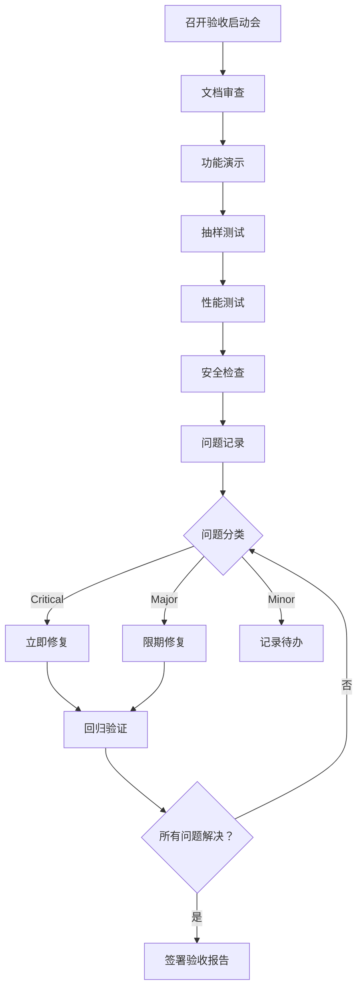

# 验收标准文档

## 文档信息

| 项目名称 | 狗狗数据分析系统 |
|---------|-----------------|
| 文档版本 | v2.4.0 |
| 创建日期 | 2026-03-23 |
| 更新日期 | 2026-03-24 |
| 编写人 | 测试团队 |
| 审批人 | 产品经理 |

---

## 一、验收概述

### 1.1 验收目的

本文档定义狗狗数据分析系统 V1.0 的验收标准和流程，确保交付产品满足需求规格说明书的要求。

### 1.2 验收范围

- 功能完整性验收
- 性能指标验收
- 安全性验收
- 用户体验验收
- 文档完整性验收

### 1.3 验收环境

| 环境要素 | 配置要求 |
|---------|---------|
| 操作系统 | Windows 10/11 |
| Python 版本 | 3.9+ |
| 数据库 | MySQL 8.0+ |
| 浏览器 | Chrome 最新版 |
| 内存 | 8GB RAM |
| 网络 | 100Mbps |

---

## 二、功能验收标准

### 2.1 用户认证模块

#### AC-AUTH-001: 用户注册功能

**验收项**:
- [ ] 用户可以成功注册新账户
- [ ] 用户名格式验证正确（3-20 字符，中文/字母/数字/下划线）
- [ ] 密码长度至少 6 位
- [ ] 重复用户名被拒绝
- [ ] 注册成功后跳转到登录页
- [ ] 密码加密存储

**测试方法**:
```bash
# 测试正常注册
curl -X POST http://localhost:5000/register \
  -d "username=testuser&password=123456"
# 预期：返回 302 重定向到登录页

# 测试重复用户名
curl -X POST http://localhost:5000/register \
  -d "username=testuser&password=123456"
# 预期：返回提示"用户名已存在"

# 测试无效用户名
curl -X POST http://localhost:5000/register \
  -d "username=ab&password=123456"
# 预期：提示用户名长度不足
```

**通过标准**: 所有测试用例通过率 100%

---

#### AC-AUTH-002: 用户登录功能

**验收项**:
- [ ] 正确凭证可以登录
- [ ] 错误凭证显示"用户名或密码错误"（不明确指出哪个错误）
- [ ] 登录后 session 正确创建
- [ ] 未登录访问受保护页面跳转登录
- [ ] 登录成功后跳转到首页或原访问页面

**测试方法**:
```bash
# 使用 Selenium 测试登录流程
from selenium import webdriver
driver = webdriver.Chrome()
driver.get('http://localhost:5000/login')
driver.find_element_by_name('username').send_keys('admin')
driver.find_element_by_name('password').send_keys('123456')
driver.find_element_by_tag_name('form').submit()
# 预期：跳转到首页，显示欢迎消息
```

**通过标准**: 登录流程无阻塞，安全测试通过

---

### 2.2 品种管理模块

#### AC-BREED-001: CRUD 操作

**验收项**:
- [ ] GET /api/breeds 返回所有品种列表
- [ ] POST /api/breeds 可以创建新品种（管理员）
- [ ] GET /api/breeds/<id> 返回单个品种详情
- [ ] PUT /api/breeds/<id> 更新品种信息
- [ ] DELETE /api/breeds/<id> 删除品种记录
- [ ] 非管理员无法执行写操作

**数据验证规则**:
- breed_name: 必填，2-100 字符，禁止 HTML 标签，唯一
- avg_life_years: 可选，0-100 岁，数值类型
- size_category: 可选，[小型，中型，大型，超大型]
- popularity: 可选，0-1000，整数

**测试方法**:
```python
# 测试添加品种
def test_add_breed(client, admin_token):
    response = client.post('/api/breeds',
        json={'breed_name': '边境牧羊犬', 'avg_life_years': 14},
        headers={'Authorization': admin_token}
    )
    assert response.status_code == 201
    data = response.get_json()
    assert 'id' in data
    assert data['message'] == '添加成功'
    
# 测试 XSS 防护
def test_xss_protection(client, admin_token):
    response = client.post('/api/breeds',
        json={'breed_name': '<script>alert(1)</script>'},
        headers={'Authorization': admin_token}
    )
    assert response.status_code == 400
    assert 'HTML 标签' in response.get_json()['error']
```

**通过标准**: 
- 所有 CRUD 操作正常
- 数据验证严格有效
- XSS 攻击被阻止

---

#### AC-BREED-002: 批量导入功能

**验收项**:
- [ ] 支持 CSV 文件格式
- [ ] 支持 Excel 文件格式（.xlsx, .xls）
- [ ] 列名支持中英文映射
- [ ] 单条失败不影响其他数据
- [ ] 返回成功数和失败数统计
- [ ] 提供详细失败原因

**测试数据**:
```csv
品种名，平均寿命，体型，人气值
哈士奇，12.5，大型，95
泰迪，14.0，小型，90
金毛，13.0，大型，88
```

**测试方法**:
```python
def test_import_csv(client, admin_token):
    with open('test_data.csv', 'rb') as f:
        response = client.post('/api/breeds/import',
            data={'file': f},
            headers={'Authorization': admin_token}
        )
    assert response.status_code == 200
    data = response.get_json()
    assert 'success' in data
    assert 'fail' in data
    assert 'details' in data
```

**通过标准**: 
- CSV 和 Excel 文件均可成功导入
- 错误处理友好且详细

---

### 2.3 图表展示模块

#### AC-CHART-001: 首页数据看板

**验收项**:
- [ ] 显示狗狗总数
- [ ] 显示平均价格（保留 2 位小数）
- [ ] 显示店铺总数（去重）
- [ ] 显示品种总数
- [ ] 显示 TOP5 热门品种
- [ ] 显示 TOP5 热门店铺
- [ ] 显示价格区间分布
- [ ] 显示血统级别比例

**数据准确性验证**:
```sql
-- 验证狗狗总数
SELECT COUNT(*) FROM jd_dogs;
-- 应与页面显示一致

-- 验证平均价格
SELECT AVG(price) FROM jd_dogs;
-- 误差 < 0.01
```

**通过标准**: 
- 所有统计数据准确无误
- 页面加载时间 < 2 秒

---

#### AC-CHART-002: 六种图表展示

**验收项**:

**价格散点图** (`/chart/scatter`)
- [ ] X 轴显示价格
- [ ] Y 轴显示数量
- [ ] 图表可交互（悬停显示详情）

**体重折线图** (`/chart/line`)
- [ ] 正确分组（6 个体重区间）
- [ ] 标记最大值和最小值
- [ ] 折线平滑

**级别柱状图** (`/chart/bar`)
- [ ] 双柱状图（宠物级 vs 血统级）
- [ ] 按品种分组
- [ ] 图例清晰

**TOP10 直方图** (`/chart/hist`)
- [ ] 显示狗狗品种 TOP10
- [ ] 显示店铺TOP10
- [ ] 支持缩放

**价格段漏斗图** (`/chart/funnel`)
- [ ] 6 个价格区间正确
- [ ] 漏斗形状合理
- [ ] 百分比标注清晰

**世界地图** (`/chart/map`)
- [ ] 地名翻译为英文
- [ ] 颜色深浅表示数量
- [ ] 缓存生效（1 小时）

**测试方法**:
```python
def test_chart_pages(client):
    charts = ['/chart/scatter', '/chart/line', '/chart/bar',
              '/chart/hist', '/chart/funnel', '/chart/map']
    for chart_url in charts:
        response = client.get(chart_url)
        assert response.status_code == 200
        assert b'<html>' in response.data
        # 检查 PyECharts 渲染代码
        assert b'echarts' in response.data.lower()
```

**通过标准**: 
- 所有图表正常渲染
- 交互功能可用
- 无明显视觉缺陷

---

### 2.4 狗粮数据模块

#### AC-FOOD-001: 狗粮统计

**验收项**:
- [ ] 显示品牌总数
- [ ] 显示平均价格
- [ ] 显示产地分布 TOP5
- [ ] 显示价格区间分布

**数据验证**:
```sql
-- 验证品牌数
SELECT COUNT(DISTINCT food_name) FROM dog_wykl;

-- 验证平均价格
SELECT AVG(CAST(price AS DECIMAL)) FROM dog_wykl;
```

**通过标准**: 统计数据准确，页面加载正常

---

## 三、性能验收标准

### 3.1 响应时间

| 页面/接口 | 目标响应时间 | 测量方法 | 通过标准 |
|----------|------------|---------|---------|
| 首页 | < 2 秒 | 10 次请求平均 | ≤ 2 秒 |
| API 接口 | < 1 秒 | 10 次请求平均 | ≤ 1 秒 |
| 图表页面 | < 5 秒 | 从请求到渲染 | ≤ 5 秒 |
| 品种列表 | < 1 秒 | 100 条数据 | ≤ 1 秒 |

**测试工具**:
```python
import time
import requests

def measure_response_time(url, times=10):
    response_times = []
    for _ in range(times):
        start = time.time()
        requests.get(url)
        end = time.time()
        response_times.append(end - start)
    return sum(response_times) / len(response_times)

# 测试首页
avg_time = measure_response_time('http://localhost:5000/')
print(f"首页平均响应时间：{avg_time:.2f}秒")
assert avg_time <= 2.0, "首页响应时间超过 2 秒"
```

**通过标准**: 所有指标达标

---

### 3.2 并发性能

**验收项**:
- [ ] 支持 10 个并发用户
- [ ] 并发请求成功率 > 95%
- [ ] 无内存泄漏

**压力测试**:
```python
from concurrent.futures import ThreadPoolExecutor
import requests

def send_request(url):
    try:
        response = requests.get(url)
        return response.status_code == 200
    except:
        return False

def concurrency_test(url, concurrent_users=10):
    with ThreadPoolExecutor(max_workers=concurrent_users) as executor:
        results = list(executor.map(send_request, [url] * concurrent_users))
    success_rate = sum(results) / len(results)
    return success_rate

success_rate = concurrency_test('http://localhost:5000/', 10)
print(f"并发成功率：{success_rate*100:.2f}%")
assert success_rate >= 0.95, "并发成功率低于 95%"
```

**通过标准**: 
- 10 并发成功率 ≥ 95%
- 服务器不崩溃
- 内存增长 < 50MB

---

### 3.3 数据库性能

**验收项**:
- [ ] 简单查询 < 100ms
- [ ] 复杂统计 < 500ms
- [ ] 连接池正常工作

**测试方法**:
```sql
-- 开启慢查询日志
SET GLOBAL slow_query_log = 'ON';
SET GLOBAL long_query_time = 0.5;

-- 执行统计查询
SELECT dog_name, COUNT(*), AVG(price) 
FROM jd_dogs 
GROUP BY dog_name 
ORDER BY COUNT(*) DESC 
LIMIT 10;

-- 检查慢查询日志
SHOW SLOW LOG;
```

**通过标准**: 无慢查询（> 500ms）

---

## 四、安全性验收标准

### 4.1 SQL 注入测试

**验收项**:
- [ ] 登录接口防 SQL 注入
- [ ] 搜索接口防 SQL 注入
- [ ] 所有数据库查询使用参数化

**测试用例**:
```python
def test_sql_injection_login(client):
    # 尝试 SQL 注入
    response = client.post('/login', data={
        'username': "' OR '1'='1",
        'password': "anything"
    })
    # 应该登录失败
    assert response.status_code != 302
    assert b'用户名或密码错误' in response.data or b'login' in response.data.lower()
```

**通过标准**: 所有 SQL 注入尝试失败

---

### 4.2 XSS 攻击测试

**验收项**:
- [ ] 输入过滤 HTML 标签
- [ ] 输出自动转义
- [ ] Script 标签无法执行

**测试用例**:
```python
def test_xss_attack(client, admin_token):
    # 尝试注入脚本
    response = client.post('/api/breeds',
        json={'breed_name': '<script>alert("XSS")</script>'},
        headers={'Authorization': admin_token}
    )
    # 应该被拒绝
    assert response.status_code == 400
    assert 'HTML' in response.get_json()['error']
    
    # 即使保存了，显示时也应该被转义
    response = client.get('/api/breeds')
    breeds = response.get_json()
    for breed in breeds:
        assert '<script>' not in breed['breed_name']
```

**通过标准**: XSS 攻击被完全阻止

---

### 4.3 CSRF 防护测试

**验收项**:
- [ ] 表单包含 CSRF token
- [ ] 提交时验证 token
- [ ] 跨站请求被拒绝

**测试方法**:
```python
def test_csrf_protection(client):
    # 不带 CSRF token 提交表单
    response = client.post('/login', data={
        'username': 'testuser',
        'password': '123456'
        # 缺少 csrf_token 字段
    })
    # 应该被拒绝（如果启用了 CSRF）
    # 或者正常处理（如果 API 豁免）
    # 根据实际配置判断
```

**通过标准**: CSRF 机制正常工作

---

### 4.4 会话安全测试

**验收项**:
- [ ] Cookie 设置 HttpOnly
- [ ] Session ID 随机且足够长
- [ ] 登出后会话销毁

**测试方法**:
```python
def test_session_security(client):
    # 登录
    response = client.post('/login', data={
        'username': 'admin',
        'password': '123456'
    })
    
    # 检查 Cookie 属性
    cookies = response.headers.getlist('Set-Cookie')
    for cookie in cookies:
        if 'session' in cookie.lower():
            assert 'httponly' in cookie.lower()
```

**通过标准**: 会话管理符合安全标准

---

### 4.5 权限控制测试

**验收项**:
- [ ] 非管理员无法访问管理页面
- [ ] 未登录无法访问受保护页面
- [ ] API 权限验证正确

**测试用例**:
```python
def test_permission_control(client):
    # 未登录访问管理页面
    response = client.get('/admin/breeds')
    assert response.status_code == 302  # 重定向到登录
    
    # 普通用户尝试添加品种
    normal_user_token = get_normal_user_token()
    response = client.post('/api/breeds',
        json={'breed_name': 'Test'},
        headers={'Authorization': normal_user_token}
    )
    assert response.status_code in [401, 403]
```

**通过标准**: 权限控制严格有效

---

## 五、用户体验验收标准

### 5.1 界面美观性

**验收项**:
- [ ] 页面布局整洁
- [ ] 色彩搭配协调
- [ ] 字体大小适中
- [ ] 图表清晰可读
- [ ] 无错位、重叠元素

**检查方法**: 人工目测检查

**通过标准**: 视觉效果良好，无明显设计缺陷

---

### 5.2 交互友好性

**验收项**:
- [ ] 按钮有明显的可点击样式
- [ ] 表单错误提示清晰
- [ ] 加载状态有反馈
- [ ] 操作结果有提示
- [ ] 导航逻辑清晰

**测试场景**:
1. 新用户首次使用能否顺利完成注册登录
2. 添加品种流程是否顺畅
3. 错误操作是否有明确提示

**通过标准**: 新手用户可在无指导下完成核心操作

---

### 5.3 错误提示友好性

**验收项**:
- [ ] 错误提示通俗易懂
- [ ] 不提供技术细节（如堆栈跟踪）
- [ ] 提供解决建议

**示例对比**:

❌ **不好的提示**:
```
Error: IntegrityError
(Duplicate entry '哈士奇' for key 'breed_name')
```

✅ **好的提示**:
```
犬种'哈士奇'已存在，请使用其他名称
```

**通过标准**: 错误提示友好、有帮助

---

## 六、文档验收标准

### 6.1 技术文档清单

- [x] 产品需求文档 (PRD)
- [x] 产品原型设计文档
- [x] 业务流程文档
- [x] 验收标准文档
- [x] API 接口文档
- [x] 开发文档
- [x] 测试计划
- [x] 测试用例
- [ ] 部署手册
- [ ] 用户手册

### 6.2 文档质量要求

**完整性**:
- [ ] 所有功能都有文档说明
- [ ] 关键流程有图示
- [ ] 示例代码完整

**准确性**:
- [ ] 文档与实际代码一致
- [ ] API 参数说明准确
- [ ] 配置步骤可执行

**可读性**:
- [ ] 结构清晰
- [ ] 语言简洁
- [ ] 术语统一

**通过标准**: 文档齐全、准确、易懂

---

## 七、验收流程

### 7.1 验收准备

1. **环境准备**
   - 搭建验收环境（独立于开发和生产）
   - 准备测试数据
   - 安装测试工具

2. **资料准备**
   - 产品需求文档
   - 设计文档
   - 测试报告
   - 用户手册草案

3. **人员准备**
   - 验收负责人
   - 业务代表
   - 技术支持

---

### 7.2 验收执行



---

### 7.3 缺陷分级

| 级别 | 定义 | 处理要求 |
|-----|------|---------|
| Critical | 系统崩溃、数据丢失、安全漏洞 | 必须立即修复，否则不通过 |
| Major | 主要功能失效、性能不达标 | 24 小时内修复 |
| Minor | 次要功能问题、UI 瑕疵 | 可记录待办，不影响验收 |
| Suggestion | 改进建议 | 纳入后续版本规划 |

---

### 7.4 验收结论

**通过条件**:
- ✅ 所有 Critical 缺陷已修复
- ✅ 所有 Major 缺陷已修复
- ✅ 功能验收通过率 ≥ 95%
- ✅ 性能测试全部达标
- ✅ 安全测试无高危漏洞
- ✅ 文档齐全

**有条件通过**:
- ⚠️ 存在 Minor 缺陷，但有明确的修复计划
- ⚠️ 部分非核心功能未完成，但不影响主要业务

**不通过**:
- ❌ 存在未修复的 Critical 或 Major 缺陷
- ❌ 功能验收通过率 < 95%
- ❌ 性能或安全测试不达标

---

## 八、验收报告模板

### 8.1 验收总结

```
项目名称：狗狗数据分析系统 V1.0
验收日期：2026-03-23
验收环境：Windows 10, Python 3.9, MySQL 8.0

一、验收范围
- 功能模块：用户认证、品种管理、图表展示、狗粮数据
- 性能指标：响应时间、并发能力
- 安全性：SQL 注入、XSS、CSRF 等

二、验收结果
1. 功能验收：通过 XX/XX 项，通过率 XX%
2. 性能验收：通过 XX/XX 项，通过率 XX%
3. 安全验收：通过 XX/XX 项，通过率 XX%
4. 文档验收：通过 XX/XX 项，通过率 XX%

三、缺陷统计
- Critical: XX 个（已修复 XX 个）
- Major: XX 个（已修复 XX 个）
- Minor: XX 个（已修复 XX 个）

四、验收结论
□ 通过
□ 有条件通过（遗留问题见附件）
□ 不通过

五、签字确认
产品经理：___________  日期：___________
技术负责人：_________  日期：___________
测试负责人：_________  日期：___________
```

---

**文档版本**: V1.0  
**最后更新**: 2026-03-23  
**审批状态**: 待审核
