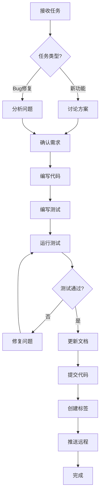

# 项目架构说明 ⚠️ 核心文档

**项目名称**: 狗狗数据分析系统  
**版本**: v1.0  
**最后更新**: 2026-04-20  
**重要性**: 🔴 最高优先级 - 所有开发必须遵循此架构

---

## 🎯 项目定位与核心价值

### 项目定位
一个功能完善的**数据可视化 Web 应用平台**，专注于狗狗品种、狗粮、价格等数据的分析与展示。

### 核心价值主张
1. **数据驱动** - 通过可视化图表展示数据分析结果
2. **用户友好** - 简洁的界面 + 网页小宠物互动
3. **可扩展性** - RESTful API 支持移动端和第三方集成
4. **质量保障** - 完善的自动化测试体系

### 目标用户
- 宠物爱好者 - 查看品种信息、数据分析
- 数据分析师 - 自定义数据上传和分析
- 开发者 - 学习 Flask 全栈开发最佳实践

---

## 🏗️ 技术架构总览

### 架构分层

```
┌─────────────────────────────────────┐
│         表现层 (Presentation)        │
│  HTML Templates + CSS + JavaScript  │
│  - 响应式布局                        │
│  - 交互式图表 (PyECharts)            │
│  - 网页小宠物 (纯前端)               │
└──────────────┬──────────────────────┘
               │ HTTP/HTTPS
┌──────────────▼──────────────────────┐
│         应用层 (Application)         │
│      Flask Web Framework            │
│  - 路由管理 (routes/)                │
│  - API 接口 (api/)                   │
│  - 业务逻辑                          │
│  - 用户认证 (Flask-Login + JWT)     │
└──────────────┬──────────────────────┘
               │ SQLAlchemy ORM
┌──────────────▼──────────────────────┐
│         数据层 (Data)                │
│      MySQL 8.0+ Database            │
│  - users (用户表)                    │
│  - dog_breeds (品种表)               │
│  - charts (图表配置)                 │
│  - pet_logs (宠物日志)               │
└─────────────────────────────────────┘
```

### 技术栈选择理由

| 层级 | 技术 | 选择理由 |
|------|------|----------|
| Web 框架 | Flask 3.1.3 | 轻量级、灵活、易于扩展 |
| ORM | SQLAlchemy 2.0.48 | 强大的查询能力、数据库无关性 |
| 数据库 | MySQL 8.0+ | 成熟稳定、性能优秀、社区支持好 |
| 可视化 | PyECharts 2.1.0 | 丰富的图表类型、中文支持好 |
| 测试 | pytest + Playwright | 完整的测试生态、UI 自动化 |
| 缓存 | Flask-Caching | 提升性能、减少数据库压力 |

---

## 📁 项目结构规范

### 目录职责划分

```
fastApiProject/
│
├── 📂 api/                      # 【核心】API 蓝图模块
│   ├── routes.py               # RESTful API 定义
│   └── __init__.py
│   ⚠️ 职责：提供标准化的 API 接口，供移动端/第三方调用
│
├── 📂 utils/                    # 【核心】工具类
│   ├── api_response.py         # API 响应助手
│   ├── auth.py                 # JWT 认证装饰器
│   └── __init__.py
│   ⚠️ 职责：通用工具函数，不依赖具体业务
│
├── 📂 routes/                   # 【核心】路由模块
│   ├── main.py                 # 主页面路由（首页、图表页等）
│   ├── auth.py                 # 认证路由（登录、注册）
│   ├── api.py                  # 内部 API 路由（品种管理、数据上传）
│   └── __init__.py
│   ⚠️ 职责：处理 HTTP 请求，调用业务逻辑，返回响应
│
├── 📂 Test/                     # 【重要】测试目录
│   ├── api_tests/              # API 接口测试
│   ├── ui_tests/               # UI 功能测试
│   ├── e2e_tests/              # E2E 集成测试
│   ├── docs/                   # 测试文档（内部使用）
│   ├── reports/                # 测试报告（动态生成）
│   ├── run_comprehensive_tests.py  # 统一测试运行器
│   └── ...
│   ⚠️ 职责：保证代码质量，防止回归问题
│
├── 📂 templates/                # 【前端】HTML 模板
│   ├── base.html               # 基础模板（所有页面继承）
│   ├── index.html              # 首页
│   ├── chart_page.html         # 图表页
│   ├── custom_analysis.html    # 自定义分析页
│   ├── login.html              # 登录页
│   └── ...
│   ⚠️ 职责：页面结构和内容
│
├── 📂 static/                   # 【前端】静态资源
│   ├── CSS/                    # 样式文件
│   │   ├── pet.css             # 宠物样式
│   │   └── ...
│   ├── JS/                     # JavaScript
│   │   ├── pet.js              # 宠物逻辑
│   │   └── ...
│   └── img/                    # 图片资源
│   ⚠️ 职责：前端资源文件
│
├── 📂 docs/                     # 【重要】项目文档
│   ├── 01-产品文档/            # 产品需求、业务流程
│   ├── 02-技术文档/            # 技术架构、API 文档
│   ├── 03-测试文档/            # 测试计划、测试报告
│   ├── 04-部署运维/            # 部署指南、运维手册
│   ├── 05-版本记录/            # 版本发布说明
│   └── README.md
│   ⚠️ 职责：项目知识沉淀，便于维护和交接
│
├── 📂 scripts/                  # 【工具】脚本工具（不提交到 Git）
│   ⚠️ 职责：临时脚本、数据处理工具
│
├── 📂 log/                      # 【日志】日志文件（不提交到 Git）
│   ⚠️ 职责：应用运行日志
│
├── app.py                       # 【入口】主应用入口
├── models.py                    # 【数据】基础数据模型
├── models_extended.py           # 【数据】扩展数据模型
├── charts.py                    # 【业务】图表生成逻辑
├── map_utils.py                 # 【工具】地图工具（地名翻译）
├── config.py                    # 【配置】配置管理
├── errors.py                    # 【错误】错误处理
├── init_db.py                   # 【初始化】数据库初始化脚本
├── conftest.py                  # 【测试】pytest 全局配置
├── pytest.ini                   # 【测试】pytest 配置文件
├── requirements.txt             # 【依赖】Python 依赖包
├── .env                         # 【配置】环境变量（不提交到 Git）
├── .env.example                 # 【配置】环境变量模板
├── .gitignore                   # 【Git】Git 忽略规则
├── CHANGELOG.md                 # 【文档】变更日志
├── CONTRIBUTING.md              # 【文档】贡献指南
├── LICENSE                      # 【许可】MIT 许可证
├── 项目管理规范.md              # 【规范】项目管理规范
└── 项目架构说明.md              # 【架构】本文件
```

### 关键原则
1. **职责单一** - 每个目录只负责一类功能
2. **层次清晰** - 表现层 → 应用层 → 数据层
3. **文档同步** - 代码变更后立即更新相关文档
4. **测试覆盖** - 新功能必须有对应测试

---

## 🔄 核心业务流程

### 1. 用户认证流程

```
用户访问 → 检查 Session/JWT → 已登录？ → 是 → 访问受保护页面
                                    ↓ 否
                              重定向到登录页
                                    ↓
                              输入用户名密码
                                    ↓
                              验证凭据
                                    ↓
                            成功？ → 是 → 创建 Session + JWT
                                    ↓       ↓
                                   否    返回首页/仪表板
                                    ↓
                              显示错误信息
```

**实现位置**: `routes/auth.py`, `utils/auth.py`

### 2. 数据可视化流程

```
用户访问图表页 → 加载页面 → 请求图表数据 → 后端查询数据库
                                            ↓
                                      生成图表配置
                                            ↓
                                      返回 JSON 数据
                                            ↓
                                  前端渲染 PyECharts
                                            ↓
                                      显示交互式图表
```

**实现位置**: `routes/main.py`, `charts.py`, `templates/chart_page.html`

### 3. 自定义数据分析流程

```
用户上传文件 → 验证文件格式 → 解析 CSV/Excel → 数据质量校验
                                                    ↓
                                              发现问题？ → 是 → 返回警告
                                                    ↓ 否
                                              存储到数据库
                                                    ↓
                                          用户选择图表类型
                                                    ↓
                                              生成图表配置
                                                    ↓
                                              显示图表结果
                                                    ↓
                                            可选：导出数据
```

**实现位置**: `routes/api.py`, `Test/api_tests/test_data_analysis_api.py`

### 4. 网页小宠物流程

```
页面加载 → 初始化宠物状态 → 从 localStorage 读取历史状态
                                ↓
                          计算离线时间差
                                ↓
                          更新宠物状态（饥饿度、心情等）
                                ↓
                          显示宠物动画
                                ↓
                    用户交互（触摸/喂食/玩耍）
                                ↓
                          更新状态并保存
                                ↓
                          定期保存到 localStorage
```

**实现位置**: `static/JS/pet.js`, `static/CSS/pet.css`

---

## 🎯 开发优先级矩阵

### P0 - 核心功能（必须保证）
- ✅ 用户认证（登录、注册、权限控制）
- ✅ 数据看板（首页指标展示）
- ✅ 图表展示（6 种图表类型）
- ✅ 品种管理（CRUD 操作）
- ✅ API 接口（RESTful 标准化）
- ✅ 自动化测试（核心功能 100% 覆盖）

### P1 - 重要功能（应该实现）
- ✅ 自定义数据分析（文件上传、图表生成）
- ✅ 网页小宠物（互动功能）
- ✅ 数据导出（CSV/Excel）
- ✅ 响应式布局（移动端适配）
- ✅ 缓存优化（性能提升）

### P2 - 次要功能（可以有）
- ⏳ 多语言支持（国际化）
- ⏳ 高级搜索和筛选
- ⏳ 用户收藏功能增强
- ⏳ 社交分享功能
- ⏳ 数据订阅通知

### 开发顺序建议
```
第一阶段：核心功能完善（P0）
  → 确保稳定性、安全性、可测试性

第二阶段：用户体验优化（P1）
  → 提升易用性、功能性、性能

第三阶段：功能扩展（P2）
  → 增加特色功能、差异化竞争
```

---

## 🧪 测试策略

### 测试金字塔

```
        /\
       /  \      E2E 测试（7 个用例）
      /----\     - 完整业务流程
     /      \    
    /--------\   UI 测试（9 个用例）
   /          \  - 页面交互、视觉验证
  /------------\ 
 /              \ API 测试（29 个用例）
/----------------\ - 接口功能、数据验证
```

### 测试执行策略

#### 开发阶段（快速反馈）
```bash
# 仅运行相关模块的测试
pytest Test/api_tests/test_breeds_api.py -v

# 或运行冒烟测试
python Test/run_comprehensive_tests.py smoke
```

#### 提交前（质量保证）
```bash
# 运行所有 API 测试
python Test/run_comprehensive_tests.py api

# 确保 100% 通过
```

#### 每日构建（全面验证）
```bash
# 运行所有测试
python Test/run_comprehensive_tests.py all

# 生成 HTML 报告
```

#### 发布前（最终确认）
```bash
# 运行 E2E 测试
python Test/run_comprehensive_tests.py e2e

# 验证完整业务流程
```

### 测试覆盖率目标
- **API 测试**: ≥ 90%（核心接口 100%）
- **UI 测试**: ≥ 70%（关键页面）
- **E2E 测试**: ≥ 80%（主要业务流程）
- **总体代码覆盖率**: ≥ 80%

---

## 📊 数据流架构

### 数据流向图

```
┌──────────┐     HTTP Request     ┌──────────┐
│  Browser │ ──────────────────→ │  Flask   │
│  (Client)│                       │  Server  │
└──────────┘                       └────┬─────┘
                                        │
                                        │ SQLAlchemy Query
                                        ↓
                               ┌────────────────┐
                               │    MySQL DB    │
                               │  (Persistent)  │
                               └────────┬───────┘
                                        │
                                        │ Query Result
                                        ↓
                               ┌────────────────┐
                               │  Flask Cache   │
                               │  (Redis/Memory)│
                               └────────┬───────┘
                                        │
                                        │ Cached Data
                                        ↓
┌──────────┐     JSON Response    ┌──────────┐
│  Browser │ ←────────────────── │  Flask   │
│  (Client)│                       │  Server  │
└──────────┘                       └──────────┘
```

### 缓存策略

| 数据类型 | 缓存时长 | 缓存位置 | 更新策略 |
|---------|---------|---------|---------|
| 品种列表 | 1 小时 | Memory | 品种变更时清除 |
| 图表配置 | 30 分钟 | Memory | 定时刷新 |
| 用户 Session | 24 小时 | Cookie | 登出时清除 |
| 统计数据 | 5 分钟 | Memory | 定时刷新 |

---

## 🔒 安全架构

### 安全防护层

```
┌─────────────────────────────────┐
│   Layer 1: 网络层安全           │
│   - HTTPS (生产环境)            │
│   - CORS 配置                   │
└──────────────┬──────────────────┘
               │
┌──────────────▼──────────────────┐
│   Layer 2: 应用层安全           │
│   - CSRF 保护                   │
│   - XSS 防护                    │
│   - SQL 注入防护 (ORM)          │
└──────────────┬──────────────────┘
               │
┌──────────────▼──────────────────┐
│   Layer 3: 认证授权             │
│   - Session 认证                │
│   - JWT Token                   │
│   - RBAC 权限控制               │
└──────────────┬──────────────────┘
               │
┌──────────────▼──────────────────┐
│   Layer 4: 数据安全             │
│   - 密码加密 (Werkzeug)         │
│   - 敏感信息隔离 (.env)         │
│   - 输入验证                    │
└─────────────────────────────────┘
```

### 敏感信息管理
- ✅ `.env` 文件不提交到 Git
- ✅ 提供 `.env.example` 模板
- ✅ `.gitignore` 正确配置
- ✅ 生产环境使用环境变量

---

## 🚀 部署架构

### 开发环境
```
本地开发 → Flask Development Server → MySQL Local
```

### 生产环境
```
用户请求 → Nginx (反向代理) → Gunicorn (WSGI) → Flask App → MySQL
                              ↓
                         Redis Cache
```

### 云平台部署
- **Railway** - 自动部署，内置数据库
- **Render** - 免费层级，适合演示
- **Heroku** - 成熟稳定，需要付费

---

## 📝 开发工作流

### 标准开发流程



### Git 工作流

```bash
# 1. 拉取最新代码
git pull origin main

# 2. 创建特性分支
git checkout -b feature/your-feature

# 3. 开发功能 + 编写测试
# ... coding ...

# 4. 运行测试
python Test/run_comprehensive_tests.py api

# 5. 提交代码（简洁信息）
git add .
git commit -m "v4.6.0"

# 6. 推送到远程
git push origin feature/your-feature

# 7. 创建 Pull Request
# 在 GitHub 上操作

# 8. 合并后打标签
git tag -a v4.6.0 -m "v4.6.0 - 功能简述"
git push origin v4.6.0
```

---

## ⚠️ 常见陷阱与避免方法

### 1. 文档不同步
**问题**: 代码更新了，文档没更新  
**解决**: 每次提交前检查文档是否需要同步

### 2. 测试遗漏
**问题**: 新功能没有测试用例  
**解决**: 先写测试，再写代码（TDD）

### 3. 敏感信息泄露
**问题**: `.env` 文件被提交到 Git  
**解决**: 提交前检查 `git status`，确认无敏感文件

### 4. 版本混乱
**问题**: 版本号不一致  
**解决**: 以 Git Tag 为准，不要手动维护版本号

### 5. 依赖冲突
**问题**: `requirements.txt` 与实际环境不一致  
**解决**: 使用 Pre-commit 钩子自动同步

---

## 🎓 学习路径建议

### 新手入门
1. 阅读 `README.md` - 了解项目概况
2. 阅读 `项目管理规范.md` - 了解开发规范
3. 运行 `python app.py` - 启动项目
4. 浏览 `docs/02-技术文档/项目说明书.md` - 深入理解

### 开发者进阶
1. 研究 `api/routes.py` - 理解 API 设计
2. 阅读 `Test/api_tests/` - 学习测试编写
3. 分析 `charts.py` - 理解业务逻辑
4. 查看 `.github/workflows/ci.yml` - 了解 CI/CD

### 架构师视角
1. 研究整体架构设计
2. 分析性能瓶颈和优化点
3. 评估可扩展性和维护性
4. 制定技术演进路线

---

## 📞 快速参考

### 常用命令
```bash
# 启动应用
python app.py

# 运行测试
python Test/run_comprehensive_tests.py api

# 初始化数据库
python init_db.py

# 查看版本
git describe --tags --always

# 查看日志
tail -f log/app.log
```

### 重要文件位置
- **主应用**: `app.py`
- **路由**: `routes/*.py`
- **API**: `api/routes.py`
- **模型**: `models.py`, `models_extended.py`
- **测试**: `Test/api_tests/`, `Test/ui_tests/`
- **文档**: `docs/`
- **配置**: `.env`, `config.py`

### 紧急联系
- **GitHub Issues**: [提交问题](https://github.com/Cguomei/FastApiProject/issues)
- **项目文档**: `docs/` 目录

---

## 🔄 持续改进

### 定期检查清单
- [ ] 测试覆盖率是否达标
- [ ] 文档是否与代码同步
- [ ] 依赖是否需要更新
- [ ] 性能是否有优化空间
- [ ] 安全是否有漏洞

### 反馈机制
- 发现问题 → 提交 Issue
- 改进建议 → 发起 Discussion
- 代码贡献 → 提交 Pull Request

---

**⚠️ 重要提醒**: 
- 本文档是项目的**核心架构说明**
- 所有开发必须遵循此架构
- 如有修改建议，请先讨论再实施
- 保持文档与代码同步更新

---

*AI 助手：Lingma AI Assistant*  
*本文档必须严格遵守，确保项目有序发展*
